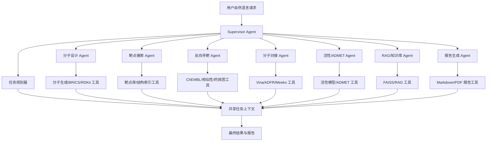

# MedChat 分子聊天系统
# 项目评估与 Agent 化演进计划书（优化版）

> 项目仓库：`github.com/kxyesyes/molecular_chat_system`
> 文档用途：组会汇报、阶段性评估、后续开发路线规划
> 项目定位：面向药物设计与药物化学场景的 AI 辅助分子设计平台

---

## 1. 项目当前基础

MedChat 已经具备较完整的药物设计教学与科研辅助原型能力，当前不是单一聊天系统，而是一个由多个 CADD 子功能组成的 Web 平台。

### 1.1 已有核心功能

当前项目已经包含以下主要模块：

| 模块 | 当前能力 |
|---|---|
| 首页对话与智能工具 | 支持自然语言输入、RAG 检索、工具路由和 LLM 接入 |
| 分子生成 | 基于本地/外部 LLM 生成 SMILES，并进行基础结构展示 |
| 分子定向设计 | 支持官能团替换、BRICS 片段、性质导向优化和迭代历史 |
| 靶点搜索 | 本地靶点库、PDE 家族与常见靶点、结构文件索引与下载 |
| 反向寻靶 | 基于 ChEMBL/相似性/3D 药效团等策略进行候选靶点预测 |
| 分子对接 | 集成 Vina、ADFRsuite、Meeko，并提供前端 3D 查看器 |
| 活性预测 | 接入本地活性预测模型，用于分子活性评估 |
| ADMET 预测 | 提供基础成药性、Lipinski/Veber 规则和性质评估 |
| RAG 知识检索 | 基于本地 FAISS 索引进行分子相关文档检索 |
| Agent 雏形 | 已有 skills、tools、contracts、orchestrators、runtime 等基础结构 |

### 1.2 当前技术栈

| 层级 | 当前选型 |
|---|---|
| 后端 | FastAPI + Uvicorn |
| 前端 | Jinja2 + 原生 JS/CSS |
| 实时通信 | WebSocket |
| 化学计算 | RDKit |
| 向量检索 | FAISS |
| 本地大模型 | Ollama，默认 `gmm-llama:latest` |
| 外部大模型 | ModelScope / OpenAI-compatible API |
| 分子对接 | AutoDock Vina + ADFRsuite + Meeko |
| 本地数据库 | SQLite |
| 部署 | systemd + Nginx + `.env` 配置 |

### 1.3 已完成的工程治理

近期已经完成了若干重要治理工作：

- 将真实 API Key 从代码和配置文件中移除，改为通过环境变量读取。
- `.env`、模型文件、SQLite、结构缓存、大型反向寻靶数据、运行输出等已加入 `.gitignore`。
- 项目已推送到 GitHub public 仓库。
- `src/target_reverse/` 已不再作为主实现存在，旧代码已归档到 `archive/legacy_target_reverse/`，现行实现统一为 `src/reverse_target/`。
- 靶点搜索模块已经从 demo 扩展到常见靶点 + PDE 家族数据。
- 分子对接模块已经支持本地 3Dmol.js，降低 CDN 不稳定带来的前端风险。
- 首页已经加入外部 LLM API Key 配置入口，具备更灵活的模型接入基础。

---

## 2. 当前主要瓶颈

项目的功能覆盖面已经较广，下一阶段的关键不再是继续堆功能，而是提升工程化、数据管理、任务编排和科研可信度。

### 2.1 工程结构仍需收敛

当前项目中部分业务逻辑仍分散在不同位置：

- `brics/` 仍位于 `src/` 之外，建议后续迁入 `src/molecular_design/` 或 `src/services/generation/`。
- 根目录样例文件已迁入 `data/samples/`，知识图谱 HTML 已迁入 `src/web/static/knowledge/`，保留原访问路由以兼容首页入口。
- `archive/legacy_target_reverse/` 已归档，运行时代码应仅引用 `src/reverse_target/`。

建议目标：形成更清晰的分层结构：

```text
src/
├── api/              # FastAPI 路由层
├── services/         # 业务逻辑层
├── repositories/     # 数据访问层
├── schemas/          # 请求/响应模型
├── agent/            # Agent 编排、skills、tools
├── web/              # 页面模板与静态资源
└── utils/            # 通用工具
```

### 2.2 配置体系需要统一

当前配置来源包括：

- `main.py` 命令行参数
- `.env`
- `config/*.yaml`
- 前端运行时 LLM 配置

这几类配置已经可以工作，但还需要进一步明确优先级和边界。

建议统一为：

```text
命令行参数 > 环境变量 .env > YAML 默认配置 > 代码默认值
```

重点需要统一：

- 服务端口，例如本地默认 6001，服务器部署通过 `.env` 覆盖。
- 模型配置，例如 Ollama、ModelScope、OpenAI-compatible API。
- 对接工具路径，例如 Vina、ADFRsuite、Meeko。
- 数据资产路径，例如靶点库、ChEMBL、FAISS、模型文件。

### 2.3 依赖清单不完整

当前 `requirements.txt` 中部分重要依赖仍处于注释状态，例如：

- `torch`
- `scikit-learn`
- `scipy`
- `mordred`
- `pytest`

这会导致新环境部署时出现“代码存在，但功能不可用”的情况。尤其是活性预测、模型推理、测试体系会受到影响。

建议后续拆分为：

```text
requirements.txt              # Web 与基础运行依赖
requirements-ml.txt           # 模型、活性预测、深度学习相关依赖
requirements-dev.txt          # pytest、ruff、black 等开发测试依赖
deployment/requirements.txt   # 服务器部署推荐依赖
```

### 2.4 数据资产尚未正式纳管

项目中存在多类关键数据资产：

- 靶点数据库 `data/target_db/target_database.sqlite`
- 靶点 seed CSV 与结构索引
- RCSB / AlphaFold 结构缓存
- 反向寻靶 ChEMBL 数据
- FAISS RAG 索引
- 活性预测模型文件
- BRICS 片段库

这些数据不适合全部提交到 Git，但必须有清晰的部署和重建方式。

建议新增：

```text
data/REGISTRY.md              # 数据资产清单
scripts/fetch_data.py         # 数据下载脚本
scripts/build_indexes.py      # 索引重建脚本
scripts/verify_data.py        # 数据完整性检查
```

每项数据资产都应记录：

- 数据来源
- 版本
- 文件路径
- 文件大小
- SHA256 校验
- 构建脚本
- 更新时间

### 2.5 长任务需要异步化

以下任务天然耗时较长：

- 分子对接
- 批量分子生成
- 批量 ADMET/活性预测
- 反向寻靶 Top-K 检索
- 靶点结构批量下载
- Agent 多步工作流

如果全部在 Web 请求中同步执行，会导致：

- 页面卡住
- WebSocket 超时
- 多用户并发能力差
- 任务失败后难以恢复

建议引入任务状态机制：

```text
queued -> running -> succeeded / failed / canceled
```

中期可使用：

- SQLite/PostgreSQL 保存任务状态
- Redis + RQ/Celery 处理异步任务
- WebSocket 或轮询推送任务进度

### 2.6 科研结果可信度需要增强

药物设计平台不能只返回“一个结果”，还需要说明结果从哪里来、可信度如何、使用了什么参数。

建议每个结果都携带 provenance：

```json
{
  "model": "gmm-llama:latest",
  "tool": "vina",
  "database": "target_db_v1",
  "parameters": {},
  "confidence": 0.82,
  "evidence": [],
  "generated_at": "2026-06-12"
}
```

重点模块：

- 分子生成：合法性、唯一性、QED、SA Score、Lipinski。
- 反向寻靶：相似分子数量、相似度、靶点证据、置信度。
- 分子对接：Vina 版本、box 参数、receptor/ligand 文件、亲和力。
- 活性预测：模型版本、训练数据来源、适用域、置信度。
- RAG：引用文档、片段来源、相似度。

---

## 3. Agent 化目标

当前项目已经具备 Agent 的初步结构，但后续目标不是简单地“让 Agent 调用几个接口”，而是让它能够完成一个完整的药物设计工作流。

### 3.1 目标场景

最终希望用户可以通过自然语言提出类似请求：

> 帮我针对 PDE4D 设计 20 个类药小分子，筛选 ADMET 性质较好的候选，进行反向寻靶和分子对接，并生成一份报告。

Agent 应能自动拆解为：

1. 识别任务目标：靶点为 PDE4D，任务为靶点导向分子设计。
2. 查询靶点数据库：获取 PDE4D 基础信息和可用蛋白结构。
3. 准备结构文件：选择推荐结构或下载缓存结构。
4. 生成候选分子：调用 `gmm-llama` 或分子设计模块生成 SMILES。
5. 校验分子：RDKit 合法性、去重、性质过滤。
6. ADMET/活性预测：筛掉低质量候选。
7. 分子对接：对优选分子进行 docking。
8. 反向寻靶：检查潜在 off-target。
9. 综合排序：按活性、ADMET、对接、可合成性排序。
10. 生成报告：输出候选分子、结构、参数、证据和下一步建议。

### 3.2 推荐 Agent 架构

建议采用“总控 Agent + 专业子 Agent + 工具层 + 数据层”的结构。



### 3.3 各 Agent 职责

| Agent | 职责 |
|---|---|
| Supervisor Agent | 理解用户意图、拆解任务、调度子 Agent、处理失败、汇总结果 |
| 分子设计 Agent | 分子生成、BRICS 替换、合法性校验、性质初筛 |
| 靶点搜索 Agent | 查询本地靶点库、选择推荐蛋白结构、准备结构文件 |
| 反向寻靶 Agent | 基于相似性、ChEMBL、药效团评估潜在靶点 |
| 分子对接 Agent | 准备 receptor/ligand、运行 Vina、解析 docking 结果 |
| 活性/ADMET Agent | 活性预测、ADMET 预测、Lipinski/Veber 过滤 |
| RAG/知识库 Agent | 检索文献/知识库内容，提供证据和引用 |
| 报告生成 Agent | 汇总结果，生成可读的科研报告 |

### 3.4 共享上下文设计

Agent 之间不应通过自然语言互相传递结果，而应通过结构化上下文共享状态。

建议定义统一 `TaskContext`：

```json
{
  "session_id": "uuid",
  "goal": "target_driven_design",
  "targets": [],
  "molecules": [],
  "structures": [],
  "docking_results": [],
  "admet_results": [],
  "reverse_target_results": [],
  "evidence": [],
  "artifacts": [],
  "history": []
}
```

这样可以避免多 Agent 协作时出现：

- 信息丢失
- 格式不一致
- 结果无法追踪
- 同一个分子被重复计算

### 3.5 工具调用规范

每个工具应具备统一接口：

```python
class Tool:
    name: str
    description: str
    input_schema: dict
    output_schema: dict

    def run(self, input: dict, context: TaskContext) -> ToolResult:
        ...
```

每次工具调用都应记录：

- 输入参数
- 输出结果
- 运行时间
- 错误信息
- 是否可重试
- 生成的文件路径
- 使用的模型或数据库版本

---

## 4. 数据库演进建议

当前 demo 阶段 SQLite 是合理的，但如果项目后续要挂网、多用户使用、保留历史记录和支持 Agent 工作流，就需要正式数据库。

### 4.1 推荐数据库组合

```text
PostgreSQL：用户、任务、实验记录、metadata、Agent 运行轨迹
Redis：任务队列、缓存、WebSocket 状态
文件仓库：PDB/mmCIF/PDBQT/SDF/MOL/报告/模型文件
FAISS 或 pgvector：RAG 与分子向量检索
```

### 4.2 PostgreSQL 优先存储内容

| 数据类型 | 是否建议入库 |
|---|---|
| 用户信息 | 是 |
| LLM API Key 配置 | 是，但必须加密 |
| 分子生成历史 | 是 |
| 分子设计迭代记录 | 是 |
| 分子对接任务记录 | 是 |
| 反向寻靶任务记录 | 是 |
| 活性/ADMET 预测记录 | 是 |
| 靶点 metadata | 是 |
| 结构文件内容 | 否，只存路径和 hash |
| 模型权重 | 否，只存路径、版本、hash |
| RAG 原始文档 | 不建议直接入库，可存文件路径 |

### 4.3 建议数据表

第一批可建立：

```text
users
llm_configs
tasks
task_events
molecules
targets
target_structures
docking_runs
reverse_target_runs
activity_predictions
admet_predictions
agent_runs
artifacts
```

其中 `tasks` 和 `agent_runs` 是 Agent 化的核心表。

---

## 5. 分阶段实施路线

### 第一阶段：工程化止血与可复现部署

目标：让项目在新机器、服务器和 Git 仓库中稳定运行。

重点任务：

1. 统一配置体系，明确 CLI / `.env` / YAML 优先级。
2. 拆分 requirements，补齐测试和 ML 依赖。
3. 持续维护 `data/samples/` 和 `src/web/static/knowledge/`，避免根目录再次积累样例/临时资产。
4. 通过测试确认 `archive/legacy_target_reverse/` 不再被运行时代码引用。
5. 持续维护 `data/REGISTRY.md`，记录数据资产来源和部署方式。
6. 持续完善 `scripts/health_check.py`，覆盖数据库、模型、工具链、缓存、Ollama。
7. 增加 GitHub Actions：基础 lint、单元测试、敏感信息扫描。

验收标准：

- 新环境按文档可启动首页。
- `.env.example` 能完整说明部署参数。
- 不依赖本机绝对路径。
- `pytest` 可以运行核心测试。
- GitHub 仓库不含真实 key、不含大型运行数据。

### 第二阶段：服务分层与异步任务

目标：让各子功能稳定可维护，长任务不阻塞页面。

重点任务：

1. 拆分 API 路由层、service 层、repository 层。
2. 将 `brics/` 迁入分子设计模块。
3. 建立统一响应格式和错误码。
4. 引入任务状态表，记录 queued/running/succeeded/failed。
5. 分子对接、批量预测、批量生成改为异步任务。
6. 前端统一展示任务进度和错误提示。
7. 靶点库、反向寻靶库、活性模型建立版本信息。

验收标准：

- 分子对接运行时页面不阻塞。
- 所有长任务都有 task_id 和状态查询。
- 每个结果能追溯输入参数和生成文件。
- API 文档清晰，前端调用稳定。

### 第三阶段：Agent 工作流闭环

目标：从“多个工具页面”升级为“自然语言驱动的药物设计工作流平台”。

重点任务：

1. 实现 Supervisor Agent。
2. 将现有子功能封装为标准 Tool。
3. 建立 TaskContext 共享上下文。
4. 实现任务规划、执行、失败重试和结果汇总。
5. 先跑通单目标流程：靶点搜索 → 分子生成 → ADMET → 对接 → 报告。
6. 再扩展到多目标、多分子、多轮优化。

验收标准：

- 用户输入一个目标，Agent 可以自动生成任务计划。
- Agent 能调用至少 3 个子模块完成完整链路。
- 失败时能给出可读原因和下一步建议。
- 最终输出结构化报告。

### 第四阶段：科研可信与多用户平台

目标：支持真实科研使用和多人协作。

重点任务：

1. SQLite 逐步迁移到 PostgreSQL。
2. 引入用户、项目、实验记录、权限管理。
3. LLM API Key 加密存储。
4. 所有结果附带 provenance、模型版本、数据库版本。
5. 建立模型治理：训练集、指标、适用域、版本。
6. 引入日志、指标、告警、任务审计。
7. 支持报告导出和项目归档。

---

## 6. 优先级建议

### 近期最该做

1. 补齐依赖与测试环境。
2. 建立数据资产清单。
3. 清理根目录样例文件。
4. 统一配置和部署说明。
5. 给每个子模块结果加 provenance 字段。

### 中期最该做

1. 分子对接异步化。
2. 反向寻靶结果和靶点库打通。
3. 分子生成结果统一校验与去重。
4. PostgreSQL 任务表初步落地。
5. Agent 工具接口标准化。

### 长期最该做

1. Supervisor Agent。
2. 多 Agent 工作流。
3. 自动报告生成。
4. 多用户项目管理。
5. 模型和数据版本治理。

---

## 7. 汇报用总结

MedChat 当前已经完成了从单一聊天界面到多模块 CADD 平台的原型搭建，覆盖了分子生成、分子设计、靶点搜索、反向寻靶、分子对接、活性预测、ADMET 和 RAG 检索等关键能力。项目下一阶段的重点不应继续简单堆叠功能，而应转向工程化治理、数据资产管理、异步任务体系和 Agent 工作流建设。

后续演进目标是将现有子功能页面封装为标准化工具，由 Supervisor Agent 负责理解用户需求、拆解任务、调度工具、记录状态、处理失败并生成报告。最终平台应支持用户通过自然语言完成从靶点选择、分子生成、性质筛选、分子对接、反向寻靶到结果报告的完整药物设计流程。

一句话概括：

> 当前 MedChat 已具备药物设计平台的功能基础，下一步要从“模块集合”升级为“数据可追溯、任务可恢复、Agent 可编排”的智能药物设计工作流平台。
