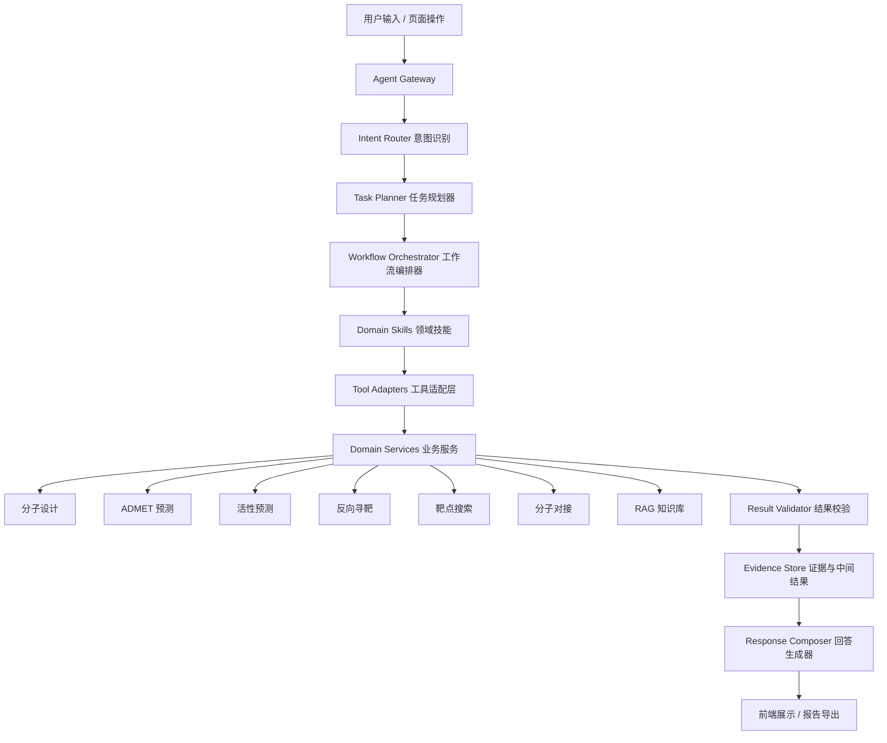

# MedChat Agent 智能化设计方案

## 1. 设计定位

MedChat 的 Agent 不应设计成一个自由聊天式大模型助手，而应设计成一个面向药物设计任务的工作流编排系统。

目标是让用户通过自然语言提出药物设计目标，系统自动完成任务拆解、工具调用、结果校验、证据整合和前端展示。大模型负责理解、规划和解释，真实计算仍由现有专业模块完成，包括分子设计、ADMET 预测、活性预测、反向寻靶、靶点搜索、分子对接和 RAG 知识库。

推荐产品定位：

> MedChat Agent 是一个面向药物设计任务的智能工作流编排器，能够把自然语言目标转化为可追踪、可解释、可复用的计算流程。

## 2. 现有基础判断

项目已经具备 Agent 雏形，不需要从零重写。

当前可复用基础：

- `src/agent/react_agent.py`：已有 ReAct 执行框架和工具选择逻辑。
- `src/agent/router.py`：已有技能路由器。
- `src/agent/skills/`：已有分子设计、活性预测、反向寻靶、靶点搜索、ADMET、分子对接、综合评估、Lead 优化等 Skill。
- `src/agent/tools/`：已有属性计算、分子生成、ADMET、反向寻靶、靶点数据库、分子对接等工具封装。
- `src/agent/contracts/`：已有 `AgentContext`、`ToolResult`、`AgentResult`、错误码等统一契约雏形。
- `src/agent/orchestrators/workflow.py`：已有基础 WorkflowOrchestrator。
- `src/agent/runtime/task_state.py`：已有任务状态和事件对象。
- `src/web/chat_handler.py`：已有 WebSocket 聊天入口和 Agent 调用入口。

主要问题不在“有没有 Agent”，而在“Agent 工程契约还不够稳定”：

- 部分旧文件中文注释和日志存在编码混乱，影响维护和日志可读性。
- 工具返回结构虽然开始统一，但不同工具仍可能混用 dict、字符串和格式化文本。
- WebSocket 仍以大段状态字符串为主，缺少标准化任务事件流。
- WorkflowOrchestrator 还偏轻量，只支持顺序执行，缺少明确的重试、超时、部分结果、产物追踪和人工确认点。
- 现有 ReAct 与 workflow skill 并存，边界需要进一步明确。
- 前端缺少统一的 Agent 任务进度展示、步骤卡片、中间结果查看和报告导出入口。

## 3. 总体架构

推荐架构采用“单主 Agent + 多领域 Skill + 工具适配器 + 工作流编排”的形式。



各层职责：

- `Agent Gateway`：统一接收聊天请求，创建 `trace_id`，读取模型配置、用户参数、会话状态。
- `Intent Router`：判断用户意图，选择合适 Skill。它只负责路由，不直接执行业务。
- `Task Planner`：把自然语言目标拆解成标准步骤，输出可执行 workflow。
- `Workflow Orchestrator`：按步骤执行工具，负责超时、重试、部分结果、事件流、产物追踪。
- `Domain Skills`：描述药物设计领域流程，例如综合评估、Lead 优化、靶点驱动设计。
- `Tool Adapters`：把现有业务模块包装成稳定工具接口。
- `Domain Services`：保留现有子功能业务能力，继续支持页面直接调用。
- `Result Validator`：校验 SMILES、数值范围、文件存在性、结构可用性、模型输出可信度。
- `Evidence Store`：保存中间结果、证据来源、产物路径和报告素材。
- `Response Composer`：把结构化结果组织成用户可读答案、表格和报告。

## 4. Agent 角色设计

第一阶段不建议引入真正并行的多 Agent。推荐采用逻辑角色设计，即一个主编排器管理多个“领域角色”。

| 逻辑角色 | 职责 | 实现方式 |
|---|---|---|
| Planner Agent | 理解用户目标并拆解任务 | Prompt + Task Planner |
| Molecule Agent | 分子生成、优化、SMILES 校验 | `molecular_design_skill` + 分子工具 |
| Target Agent | 靶点搜索、反向寻靶、结构索引 | `target_search_skill` + `reverse_target_skill` |
| Docking Agent | 蛋白准备、配体准备、Vina 对接 | `docking_skill` + docking service |
| ADMET Agent | 类药性、ADMET、规则过滤 | `admet_skill` + property/admet tools |
| Evidence Agent | RAG 检索、文献证据、数据库证据 | `rag_search_skill` |
| Reviewer Agent | 检查结果可信度、风险和下一步建议 | Validator + Summary Prompt |

这样既能在汇报中体现多角色协作，也不会过早引入复杂的多模型并发通信。

## 5. 核心工作流

### 5.1 综合评估工作流

适用输入：

```text
全面分析这个分子：CCO
```

执行步骤：

1. 提取并校验 SMILES。
2. 计算基础性质：MW、LogP、TPSA、HBD、HBA、QED、SA Score。
3. 执行 ADMET 预测。
4. 执行活性预测。
5. 执行反向寻靶。
6. 查询命中靶点是否存在本地 3D 结构。
7. 汇总优点、风险、推荐实验和下一步优化方向。

输出：

- 分子结构图。
- 基础性质表。
- ADMET 风险标签。
- 活性预测结果。
- 可能靶点排名。
- 可用蛋白结构列表。
- 文字总结和报告导出入口。

### 5.2 靶点驱动分子设计工作流

适用输入：

```text
针对 PDE5 设计 20 个类药候选分子，并筛选适合 docking 的前 5 个。
```

执行步骤：

1. 识别靶点名称 PDE5。
2. 调用靶点搜索模块，定位 PDE5A、UniProt、PDB/AlphaFold 结构。
3. 根据实验结构、分辨率、配体、docking 推荐标记筛选结构。
4. 调用分子生成模块生成候选分子。
5. 用 RDKit 校验 SMILES，剔除非法分子。
6. 计算基础性质和类药性。
7. 执行 ADMET 预测。
8. 执行活性预测。
9. 对 Top 候选分子执行 docking。
10. 综合排序并输出 Top 5。

输出：

- 靶点卡片。
- 推荐蛋白结构。
- 候选分子表。
- ADMET/活性/docking 综合评分。
- Top 5 推荐理由。
- 下载结构、配体、对接结果和报告的入口。

### 5.3 Lead 优化工作流

适用输入：

```text
优化这个分子，让 LogP 降低，QED 提高。
```

执行步骤：

1. 解析原始分子。
2. 计算当前性质。
3. 抽取优化目标。
4. 生成类似物或官能团替换候选。
5. 对候选分子进行合法性校验。
6. 计算性质变化。
7. 执行 ADMET 和活性预测。
8. 按优化目标排序。
9. 输出结构变化解释。

输出：

- 原分子与候选分子对比。
- Delta 性质变化。
- 优化目标达成情况。
- 推荐候选和下一轮优化建议。

### 5.4 反向寻靶增强工作流

适用输入：

```text
这个分子可能作用于哪些靶点？
```

执行步骤：

1. 校验 SMILES。
2. 执行 2D 相似性检索。
3. 执行 3D 药效团精修。
4. 聚合去重靶点。
5. 查询靶点数据库中的结构文件。
6. 给出证据、可信度和可对接建议。

输出：

- 靶点排名。
- 相似分子证据。
- 3D 药效团评分。
- 命中靶点是否有本地蛋白结构。
- “发送到分子对接”的入口。

## 6. 统一数据契约

所有工具必须返回 `ToolResult` 或能被 `execute_tool_compat` 转换为 `ToolResult`。

标准结构：

```python
{
    "tool_name": "admet_predictor",
    "success": True,
    "message": "ADMET 预测完成",
    "data": {},
    "formatted": "",
    "error": None,
    "elapsed_ms": 1200
}
```

建议在下一阶段扩展字段：

```python
{
    "evidence": [],
    "warnings": [],
    "artifacts": [],
    "quality": {
        "confidence": 0.82,
        "source": "local_model",
        "validated": True
    }
}
```

关键领域对象：

- `MoleculeCandidate`：候选分子，包含 SMILES、结构图、性质、ADMET、活性、来源。
- `TargetCandidate`：候选靶点，包含 gene、protein、UniProt、organism、evidence。
- `StructureCandidate`：蛋白结构，包含 PDB/AlphaFold ID、分辨率、链、配体、文件路径、docking 推荐。
- `DockingJob`：对接任务，包含 receptor、ligand、box、参数、状态。
- `DockingResult`：对接结果，包含 score、pose 文件、interaction、日志。
- `AgentWorkflowState`：Agent 一次工作流完整状态。

## 7. 任务状态与事件流

每次 Agent 调用都应生成一个 `trace_id`，并维护 `AgentTaskState`。

推荐事件类型：

- `task_started`
- `planning_started`
- `planning_completed`
- `tool_started`
- `tool_progress`
- `partial_result`
- `tool_completed`
- `tool_failed`
- `validation_warning`
- `task_completed`
- `task_failed`

前端不再只依赖普通字符串状态，而是消费标准事件：

```json
{
  "type": "agent_event",
  "trace_id": "agent-20260611-001",
  "event": "tool_started",
  "skill": "target_driven_design",
  "tool": "target_database_search",
  "message": "正在搜索 PDE5 相关靶点",
  "progress": 0.2
}
```

这样前端可以稳定渲染任务步骤，而不是解析自然语言。

## 8. 前端交互设计

首页 Agent 任务建议采用“聊天 + 任务面板”的混合形式。

用户输入任务后，前端展示：

```text
正在解析任务...
正在搜索靶点...
正在筛选蛋白结构...
正在生成候选分子...
正在计算 ADMET...
正在执行分子对接...
正在生成总结...
```

最终结果区域展示：

- 工作流步骤时间线。
- 每个步骤的状态、耗时和错误提示。
- 候选分子卡片。
- 靶点和结构表格。
- ADMET 风险标签。
- docking score 排名。
- 证据来源。
- 下载报告按钮。
- “继续优化该分子”按钮。

子功能页面保持独立，但可以增加“交给 Agent 继续分析”的入口。

## 9. 错误处理与安全边界

必须明确区分以下错误：

- 用户输入错误：SMILES 无效、靶点名称不存在、参数超范围。
- 工具不可用：Vina、ADFRsuite、RDKit、模型文件缺失。
- 模型不可用：Ollama 未启动、API Key 缺失、外部 API 超时。
- 数据不足：本地数据库无匹配结果、本地结构文件缺失。
- 部分成功：ADMET 成功但 docking 失败，或反向寻靶成功但结构查询失败。

Agent 不能因为某一步失败就丢弃全部结果。推荐策略：

- 可跳过步骤失败：返回部分结果并提示缺失项。
- 关键步骤失败：终止 workflow，并给出可操作修复建议。
- 外部工具失败：返回环境检查建议，附 `scripts/health_check.py` 命令。
- 模型输出非法 SMILES：自动重试一次；仍失败则剔除该候选。

## 10. 记忆与复用

Agent 需要支持短期任务记忆，至少包括：

- 当前研究靶点。
- 当前 lead molecule。
- 最近生成的候选分子。
- 最近一次反向寻靶结果。
- 最近一次 docking 任务。
- 用户设置的筛选条件。

这样用户才能继续追问：

```text
把第 3 个分子的 LogP 再降一点。
```

或：

```text
把刚才排名前 5 的分子拿去和 PDE5 做 docking。
```

第一阶段可将状态保存在内存和 `scratch/agent_runs/`，后续再升级为 SQLite 或项目数据库。

## 11. 实施路线

### 阶段一：稳定 Agent 基础契约

目标：

- 修复 Agent 相关文件中的编码混乱日志和文案。
- 强制所有工具输出统一 `ToolResult`。
- 扩展 `AgentResult`，支持 warnings、evidence、artifacts。
- 补齐测试，覆盖工具成功、失败、部分结果。

### 阶段二：事件化工作流

目标：

- 让 WorkflowOrchestrator 输出标准 `TaskEvent`。
- WebSocket 发送结构化 agent event。
- 前端首页渲染任务步骤和中间结果。

### 阶段三：综合评估工作流

目标：

- 打通“输入一个分子 → 性质 → ADMET → 活性 → 反向寻靶 → 靶点结构查询 → 总结”。
- 这是风险最低、最适合作为第一个 Agent 闭环的 workflow。

### 阶段四：靶点驱动设计工作流

目标：

- 以 PDE 家族为重点，打通“靶点 → 结构 → 生成 → 筛选 → docking → 排序”。
- 这是最适合汇报和展示的核心能力。

### 阶段五：报告和继续优化

目标：

- 导出 HTML/PDF/CSV。
- 支持从历史任务继续优化。
- 支持从结果卡片一键进入分子设计、靶点搜索或分子对接页面。

## 12. 验收标准

第一阶段验收：

- 所有 Agent 工具返回结构一致。
- 无 API Key 空字符串导致的 `Bearer ` 请求错误。
- 无非法 SMILES 直接进入结构图渲染。
- Agent 失败时返回清晰错误和修复建议。

第二阶段验收：

- 首页能显示标准任务步骤流。
- 每一步能展示成功、失败、耗时。
- 部分失败时仍能展示已完成结果。

第三阶段验收：

- 输入一个合法 SMILES 后，可完成综合评估并返回结构化结果。
- 结果包含性质、ADMET、活性、反向寻靶和结构可用性。

第四阶段验收：

- 输入“针对 PDE5 设计 20 个类药候选分子，并筛选适合 docking 的前 5 个”后，系统能完成端到端流程。
- 输出 Top 候选分子、ADMET 风险、活性预测、推荐蛋白结构和 docking 结果。

## 13. 推荐结论

MedChat 最适合采用“工作流编排 Agent”路线。

它不是让大模型替代专业计算模块，而是让大模型把现有模块组织成可解释的药物设计流程。这样既能保留本地数据库、RDKit、Vina、ADMET、活性预测等模块的可靠性，又能体现自然语言驱动的智能化体验。

最建议优先落地的两条工作流：

1. 综合评估：输入分子，输出完整药物设计评价。
2. 靶点驱动设计：输入靶点，输出候选分子、筛选结果和 docking 排名。

这两条路线覆盖面最大，最适合后续项目演示、论文汇报和平台挂网展示。
