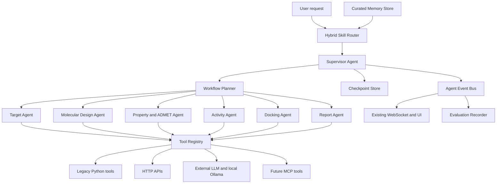

# MedChat Agent Platform Enhancement Design

**Date:** 2026-06-18
**Status:** Approved for implementation
**Scope:** State persistence, curated long-term memory, centralized multi-agent collaboration, tool adaptation, skill routing, and evaluation

## 1. Goal

Upgrade the existing MedChat Agent architecture into a durable, observable, and extensible agent platform while preserving the current FastAPI, Jinja, vanilla JavaScript, `ReActMolecularAgent`, `SupervisorAgent`, `WorkflowOrchestrator`, `SkillRegistry`, and `agent_event` contracts.

The design borrows proven patterns from LangGraph checkpointers and stores, LangGraph Supervisor, tool-schema ecosystems, and modern agent evaluation systems without transferring runtime ownership to an external framework.

## 2. Architectural Decision

MedChat will retain its native runtime and introduce framework-compatible interfaces around it.

The system will not migrate wholesale to LangGraph, CrewAI, AutoGen, or Pydantic AI. Instead, it will adopt the following mature patterns:

- checkpoint and store separation;
- centralized supervisor orchestration;
- typed agent and tool contracts;
- explicit handoff boundaries;
- durable execution and idempotency;
- structured execution traces;
- versioned offline and integration evaluations.

This approach keeps molecular tools, model isolation, workflow events, and UI behavior under project control while allowing future adapters for external ecosystems.

## 3. Target Architecture



### 3.1 Model ownership

- The external OpenAI-compatible model is responsible for language understanding, ambiguous routing, planning, and final report generation.
- Local Ollama `gmm-llama:latest` is exclusively owned by the Molecular Design Agent and remains the only model used by `llm_molecular_generator`.
- Model configuration changes for the main model must never replace the molecular generator model.
- Tool outputs remain authoritative. The Report Agent must not invent molecular structures, scores, properties, docking poses, or experimental evidence.

## 4. Persistence and Long-Term Memory

Persistence is split into two stores with different trust and retention rules.

### 4.1 Checkpoint Store

The Checkpoint Store records recoverable execution state. A checkpoint is identified by `trace_id`, `workflow_version`, and `step_id`.

Each checkpoint stores:

- `user_id` and `session_id` when available;
- selected skill and route decision;
- normalized workflow plan;
- step dependency state;
- pending, running, succeeded, failed, partial, or cancelled status;
- normalized tool inputs and outputs;
- error code, retry count, and degradation path;
- molecule, target, structure, activity, ADMET, and docking intermediate data;
- artifact metadata and filesystem paths;
- model, tool, adapter, prompt, and workflow versions;
- event sequence number and timestamps;
- input hash and idempotency key.

The orchestrator writes a checkpoint atomically after:

- planning completes;
- a tool starts;
- a tool succeeds or fails;
- a retry decision is made;
- an artifact is registered;
- a workflow reaches a terminal state.

On restart, the Supervisor reloads the latest compatible checkpoint. A completed step is reused only when its normalized input hash, tool version, adapter version, and relevant model version still match.

### 4.2 Memory Store

The Memory Store contains curated cross-session knowledge rather than raw execution history.

Allowed memory categories:

- explicitly confirmed user preferences;
- structured summaries of successful workflows;
- validated molecule, target, structure, and evaluation conclusions;
- routing corrections and accepted skill selections;
- reusable tool-selection observations;
- artifact references and provenance;
- documented workflow constraints.

Content excluded by default:

- API keys, tokens, credentials, and environment variables;
- complete chat transcripts;
- unverified LLM speculation;
- failed or invalid tool outputs presented as facts;
- raw binary structures and large result files;
- hidden prompts and internal reasoning traces.

Structure files and other large artifacts remain on disk. Memory records store path, content hash, media type, source, and validation status.

### 4.3 Memory retrieval

Memory retrieval may use:

- `user_id` and `session_id`;
- target identifiers;
- canonical SMILES;
- workflow and skill names;
- structured tags;
- semantic similarity;
- confidence;
- recency;
- provenance and validation status.

Retrieved memory is placed in a bounded `AgentContext.memory` collection. Memory may inform routing, planning, and reporting, but it cannot independently authorize tool execution or override the current user request.

### 4.4 Storage backend

The first backend is SQLite with WAL mode and explicit transactions. Storage is accessed only through interfaces so PostgreSQL can replace SQLite later.

Initial tables:

- `agent_runs`
- `agent_checkpoints`
- `agent_events`
- `tool_executions`
- `workflow_artifacts`
- `long_term_memories`
- `routing_feedback`
- `evaluation_runs`
- `evaluation_cases`
- `evaluation_results`

## 5. Centralized Multi-Agent Collaboration

### 5.1 Supervisor responsibilities

The Supervisor is the only component permitted to:

- select or confirm the active skill;
- create and version workflow plans;
- assign work to specialist agents;
- resolve dependencies;
- load and save checkpoints;
- enforce budgets, timeouts, and concurrency;
- retry, degrade, pause, resume, or cancel work;
- combine evidence and produce the final workflow result.

Specialist agents cannot freely transfer control to one another. All delegation passes through the Supervisor.

### 5.2 Initial specialist agents

#### Target Agent

Owns target lookup, target normalization, structure discovery, and receptor selection. It may use target search and structure metadata tools.

#### Molecular Design Agent

Owns molecular generation and optimization. It exclusively uses local `gmm-llama:latest` through the molecular generation adapter.

#### Property and ADMET Agent

Owns physicochemical properties, drug-likeness, ADMET calculations, validation, and labelled fallback estimates.

#### Activity Agent

Owns RG-MPNN and other activity model invocation, model provenance, applicability warnings, and prediction results.

#### Docking Agent

Owns docking preparation, receptor and ligand validation, execution, artifact registration, and result normalization.

#### Report Agent

Uses the external main model to summarize validated outputs and evidence. It has read-only access to normalized results and cannot call generation or scientific execution tools directly.

### 5.3 Agent task contract

Shared retry behavior is represented by:

```python
@dataclass(frozen=True)
class RetryPolicy:
    max_attempts: int = 1
    backoff_seconds: float = 0.0
    retryable_error_codes: set[str] = field(default_factory=set)
```

```python
@dataclass
class AgentTask:
    task_id: str
    trace_id: str
    agent_name: str
    objective: str
    inputs: dict[str, Any]
    allowed_tools: list[str]
    dependencies: list[str]
    retry_policy: RetryPolicy
    timeout_seconds: float
    idempotency_key: str
    metadata: dict[str, Any]
```

```python
@dataclass
class AgentTaskResult:
    task_id: str
    status: str
    outputs: dict[str, Any]
    tool_results: list[ToolResult]
    artifacts: list[WorkflowArtifact]
    evidence: list[dict[str, Any]]
    warnings: list[str]
    error: AgentExecutionError | None
    metrics: dict[str, Any]
```

Each specialist agent receives only the tools listed in `allowed_tools`.

## 6. Failure Recovery and Durable Execution

Failure handling is based on structured error classes:

- transient network and provider errors: bounded exponential-backoff retry;
- tool timeout: retry only when the tool declares the operation idempotent;
- invalid SMILES or invalid structured input: no automatic retry without transformed input;
- missing optional dependency: use an explicitly labelled fallback when available;
- optional step failure: continue and mark the result partial;
- required step failure: persist state and stop or request user input;
- process restart: resume from the latest compatible checkpoint;
- changed tool, model, workflow, or input version: invalidate affected downstream steps;
- duplicate request: return or resume the existing run through its idempotency key;
- cancellation: persist all completed results and mark unfinished steps cancelled.

No successful expensive step is repeated when its input and execution versions remain compatible.

## 7. Unified Tool Adaptation Layer

### 7.1 Tool specification

```python
@dataclass(frozen=True)
class ToolSpec:
    name: str
    version: str
    description: str
    input_schema: type[BaseModel]
    output_schema: type[BaseModel]
    capabilities: set[str]
    timeout_seconds: float
    retry_policy: RetryPolicy
    side_effects: str
    idempotent: bool
    sensitive_fields: set[str]
```

### 7.2 Adapter contract

`ToolAdapter` provides:

- Pydantic input and output validation;
- uniform sync and async execution;
- timeout, retry, cancellation, and concurrency controls;
- normalized error codes;
- event and metric emission;
- artifact registration;
- sensitive-field redaction;
- result caching and idempotency;
- health and capability reporting.

Initial adapters:

- `LegacyPythonToolAdapter`
- `HTTPToolAdapter`
- `ModelToolAdapter`
- `CompositeToolAdapter`
- a reserved `MCPToolAdapter` interface

Migration is incremental. Existing tools continue working through `execute_tool_compat` until an adapter is available. New orchestration code uses the registry rather than importing concrete tools directly.

### 7.3 Tool registry

The registry indexes tools by:

- canonical name and aliases;
- version;
- capabilities;
- accepted input type;
- agent ownership;
- availability and health;
- cost and latency class;
- side-effect level.

The registry can reject plans referencing unavailable, unhealthy, or unauthorized tools before execution begins.

## 8. Hybrid Skill Routing

Routing uses four stages.

### 8.1 Deterministic high-confidence rules

Explicit SMILES, targets, generation requests, ADMET requests, docking requests, and supported workflow phrases use deterministic entity-aware rules.

### 8.2 Candidate scoring

All plausible skills receive scores based on:

- matched entities and keywords;
- input shape;
- workflow intent;
- required tool availability;
- confirmed user preferences;
- prior routing feedback;
- estimated cost and latency;
- contradiction and exclusion rules.

The router returns ranked Top-K candidates rather than stopping at the first keyword hit.

### 8.3 Structured LLM arbitration

The external main model is used only when candidate scores are close or deterministic confidence is below threshold. The model receives the bounded candidate set and must return a schema-validated decision.

```python
class RouteCandidate(BaseModel):
    skill_name: str
    score: float
    reasons: list[str]
```

```python
class RouteDecision(BaseModel):
    selected_skill: str | None
    confidence: float
    candidates: list[RouteCandidate]
    reasons: list[str]
    source: Literal["rule", "scoring", "llm", "fallback"]
    requires_confirmation: bool = False
```

### 8.4 Safe fallback

Low-confidence routing does not trigger expensive or high-impact tools. The system provides a general response or asks for missing information.

Human routing corrections are written to `routing_feedback`. Feedback is used by offline evaluation and controlled rule updates; production routing weights are not changed automatically.

## 9. Evaluation System

### 9.1 Versioned datasets

- `routing_cases.jsonl`
- `tool_selection_cases.jsonl`
- `workflow_cases.jsonl`
- `chemistry_quality_cases.jsonl`
- `failure_recovery_cases.jsonl`

Every case has an ID, version, tags, expected result, accepted alternatives, fixtures, and evaluator configuration.

### 9.2 Metrics

Routing:

- Top-1 and Top-3 accuracy;
- confusion matrix;
- false execution rate;
- correct abstention rate;
- confidence calibration.

Tools:

- tool selection accuracy;
- argument validity;
- schema-conformance rate;
- unauthorized tool-call rate;
- timeout, retry, fallback, and cache rates.

Workflows:

- required-step completion;
- full success and partial-result rates;
- dependency correctness;
- checkpoint recovery correctness;
- duplicate-execution rate;
- evidence and artifact coverage.

Chemistry:

- valid SMILES rate;
- uniqueness and requested-count compliance;
- canonicalization success;
- property and ADMET output completeness;
- activity model provenance;
- docking artifact validity.

Performance:

- P50 and P95 workflow latency;
- per-tool latency;
- model call count;
- token and provider cost where available;
- retry overhead;
- event and streaming volume.

### 9.3 Evaluation modes

#### Contract evaluation

Fully offline and deterministic. Validates schemas, routing rules, adapters, planner dependencies, persistence, and recovery.

#### Replay evaluation

Replays stored normalized tool outputs to evaluate routing, orchestration, reporting, and UI events without re-running expensive scientific tools.

#### Real integration evaluation

Runs controlled calls against the external main model, local Ollama, RG-MPNN, target search, and configured scientific tools.

Real evaluations never persist credentials. Reports store provider, model, latency, result status, and redacted errors only.

## 10. Security and Privacy

- Secrets may only come from environment variables or the existing runtime settings boundary.
- Checkpoints and memories pass through recursive sensitive-field redaction.
- Tool adapters declare sensitive input and output fields.
- SQL uses parameterized statements.
- Artifact paths are normalized and constrained to configured project data roots.
- The Memory Store refuses unvalidated binary content and credential-shaped strings.
- Report generation receives normalized result subsets, not raw environment state or unrestricted files.
- External tools and MCP servers are untrusted and require explicit capability allowlists.
- Every persisted record includes provenance and creation time.

## 11. Migration Strategy

### Phase 1: Durable state foundation

- Add persistence interfaces and SQLite backend.
- Persist runs, events, checkpoints, tool executions, and artifacts.
- Add resume and idempotency behavior to the current orchestrator.
- Preserve existing WebSocket event payloads.

### Phase 2: Tool adaptation

- Add `ToolSpec`, `ToolAdapter`, and `ToolRegistry`.
- Wrap molecular generator, property, ADMET, activity, target, and docking tools.
- Keep legacy compatibility for unwrapped tools.

### Phase 3: Centralized specialist agents

- Introduce typed Agent tasks and results.
- Move scientific domain responsibilities into specialist agents.
- Make Supervisor the single delegation and recovery boundary.

### Phase 4: Curated memory and routing

- Add memory policy, retrieval, and explicit preference confirmation.
- Add ranked route decisions and structured LLM arbitration.
- Record routing feedback.

### Phase 5: Evaluation and observability

- Add versioned evaluation datasets and runner.
- Add replay fixtures and reports.
- Extend current metrics into trace-linked routing, tool, workflow, chemistry, and latency metrics.

Each phase is independently testable and must preserve the existing UI and legacy Agent entry points.

## 12. Testing Strategy

### Unit tests

- persistence transactions and schema migration;
- checkpoint compatibility and invalidation;
- redaction and memory admission;
- task and result contracts;
- tool adapter validation;
- route scoring and structured arbitration;
- evaluator calculations.

### Integration tests

- Supervisor planning and specialist delegation;
- generated SMILES propagation through downstream tools;
- checkpoint resume after controlled interruption;
- duplicate request idempotency;
- optional and required failure behavior;
- SQLite restart recovery;
- WebSocket event ordering;
- legacy tool compatibility.

### Real tests

- external main-model routing and report generation;
- local `gmm-llama:latest` generation;
- RG-MPNN activity prediction;
- real target search;
- configured docking path;
- redacted trace and evaluation output.

The MedChat Conda Python executable remains the required environment for RDKit-backed tests.

## 13. Acceptance Criteria

The enhancement is accepted when:

- a running workflow can resume after process restart without repeating completed compatible steps;
- long-term memory contains only admitted structured records;
- the Supervisor delegates through typed specialist-agent contracts;
- unauthorized tool usage is rejected;
- existing tools run through adapters or the compatibility bridge;
- routing produces a scored and explainable decision;
- routing, tool, workflow, chemistry, recovery, and latency evaluations run from versioned datasets;
- existing `agent_event` and `agent_result` UI behavior remains compatible;
- the main external model and local molecular generator remain isolated;
- all automated tests and controlled real integration tests pass;
- no secret appears in persisted state, evaluation reports, logs, or committed files.

## 14. External References

- LangGraph: https://github.com/langchain-ai/langgraph
- LangGraph Supervisor: https://github.com/langchain-ai/langgraph-supervisor-py
- LangGraph Swarm: https://github.com/langchain-ai/langgraph-swarm-py
- Pydantic AI: https://github.com/pydantic/pydantic-ai
- CrewAI: https://github.com/crewAIInc/crewAI

These projects are references for architectural patterns. MedChat remains the owner of its runtime, domain contracts, scientific tools, persistence schema, and event protocol.
