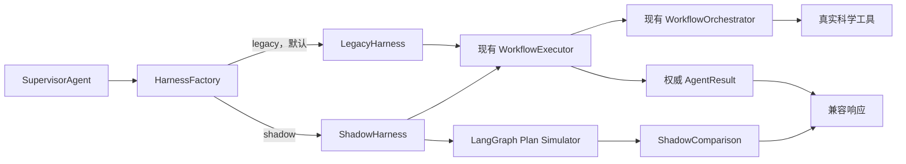

# MedChat 工业级 Agent 阶段 2A：可信 Harness 与 LangGraph Shadow 设计

**日期：** 2026-08-10

**状态：** 已确认，待实施

**上位设计：** `docs/superpowers/specs/2026-08-10-industrial-agent-platform-design.md`

## 1. 背景

阶段 1 已建立科学结果契约、能力目录、计划编译、显式数据绑定、候选分子 RDKit 校验、证据账本和真实性门。真实验收显示当前主链能够执行 RDKit、Ollama 和 AutoDock Vina，并会将不可用的 RG-MPNN、空靶点数据库结果和缺失反向寻靶数据标记为 partial，而不是伪造成成功。

当前仍有两个会影响真实科研可信度的 P0 问题：

1. `target_driven_design` 虽然声明了上游绑定，但靶点搜索返回空记录时，分子生成仍可能收到 `Validated target evidence: None` 并继续执行。这种行为不再是“靶点驱动设计”。
2. 候选分子只以松散列表或 SMILES 文本流转，缺少稳定 `candidate_id`。请求 10 个候选时，下游批量结果可能出现 11 条，无法可靠判断哪一条性质、ADMET 或活性结果属于哪个候选。

阶段 2A 先修复上述科学语义问题，再在现有执行链外建立可回滚的 LangGraph shadow harness。默认执行行为保持不变，LangGraph 不执行科研工具，也不接管生产流量。

## 2. 目标与非目标

### 2.1 目标

- 将“有绑定”提升为“上游输出满足科学语义要求后才能继续”。
- 实体化 `CandidateSet@1`，让生成、性质、ADMET、活性和排序共享稳定候选身份。
- 在 `SupervisorAgent` 与 `WorkflowExecutor` 之间建立框架无关的 Harness 接口。
- 以可选依赖和 feature flag 引入 LangGraph shadow 状态推演。
- 比较 legacy 与 shadow 的计划、依赖、风险门和终态，不重复执行科学工具。
- 保持 `AgentResult`、事件、持久化和 Web 兼容响应的现有权威链路。
- 为后续 `legacy -> shadow -> langgraph` 迁移建立可测量的晋级条件。

### 2.2 非目标

- 不开放 LangGraph 作为正式执行后端。
- 不引入 LLM 动态规划或自动重规划。
- 不修改前端展示和 WebSocket 事件协议。
- 不建立第二套 checkpoint 数据库。
- 不升级现有 LangChain 0.2 依赖族。
- 不引入 Temporal、PostgreSQL、Redis、NATS、LiteLLM Gateway 或微服务拆分；这些属于上位平台设计的后续阶段。
- 不改变本地 `gmm-llama:latest` 作为分子生成模型的边界。

## 3. 架构



### 3.1 `HarnessBackend`

`HarnessBackend` 是框架无关协议。输入为同一份 `AgentContext`、`WorkflowPolicy`、工具集合和可选事件回调；输出包含权威 `WorkflowExecution` 与可选的 `ShadowComparison`。

该接口不暴露 LangGraph 类型，避免 `SupervisorAgent`、Web 层和科学工具依赖具体编排框架。

### 3.2 `LegacyHarness`

`LegacyHarness` 是现有 `WorkflowExecutor` 的薄适配器：

- 调用当前 planner、compiler、preflight 和 orchestrator；
- 不改变工具授权、事件顺序、状态持久化或 `AgentResult`；
- 在未配置 Harness 或未安装 LangGraph 时提供完整功能。

### 3.3 `ShadowHarness`

`ShadowHarness` 执行顺序固定为：

1. 通过 legacy 链产生唯一权威结果；
2. 将同一份已编译计划和权威执行摘要交给 LangGraph plan simulator；
3. 对比 workflow、节点顺序、依赖、required/optional、风险门、候选映射和终态；
4. 将脱敏比较摘要写入 `AgentResult.metadata["harness_shadow"]`。

Shadow 不获得可执行工具注册表，不调用 RDKit、Ollama、RG-MPNN、Vina、RAG、数据库或外部模型。它只处理结构化控制状态，因此不存在重复成本、重复 artifact、外部副作用或随机科学结果漂移。

### 3.4 `LangGraphPlanSimulator`

Simulator 使用 LangGraph `StateGraph` 表达已编译计划。每个节点只读取和更新控制状态，不运行工具。图必须在调用前编译，由图结构检查发现孤立节点、缺失依赖和非法终止条件。

阶段 2A 不使用 LangGraph checkpointer。权威恢复和幂等性继续由现有 `AgentStateStore` 管理。LangGraph checkpoint 持久化只在其准备接管执行时单独设计。

### 3.5 `HarnessFactory`

`HarnessFactory` 读取 `AGENT_HARNESS_MODE`：

- `legacy`：默认，返回 `LegacyHarness`；
- `shadow`：LangGraph 可用时返回 `ShadowHarness`；
- `langgraph`：阶段 2A 禁止，回落 `legacy` 并记录运维 warning；
- 其他值：回落 `legacy` 并记录配置 warning。

LangGraph 采用延迟导入。未安装依赖但请求 shadow 时，用户科研请求仍由 legacy 正常完成，metadata 记录 `shadow_status=unavailable`。

## 4. 科学语义门

### 4.1 靶点证据要求

`target_driven_design` 的 molecule generation 节点必须声明 `target_evidence` 前置条件。前置条件只有在 `target_database_search` 返回至少一条可用证据时满足。

一条可用靶点证据必须包含：

- 非空靶点标识；以及
- 数据库来源、结构 ID、可读取 artifact 或结构化 evidence 引用中的至少一项。

“工具调用成功但返回空记录”、纯自然语言 `None`、没有来源的模型推断和 demo/fallback 结果均不满足前置条件。

### 4.2 前置条件失败行为

当靶点证据为空或不可用时：

- 不调用 `llm_molecular_generator`；
- 不调用候选性质、ADMET、活性或排序步骤；
- 保留靶点搜索的真实 `ToolResult`；
- 后续步骤记录为 `skipped_precondition`；
- 工作流返回 `partial`，并明确说明不能完成“靶点驱动”生成；
- 不自动退化为无约束分子生成。

只有用户显式请求无约束生成时，才能由另一个 workflow 执行；不能在 target-driven workflow 内隐式降级。

## 5. `CandidateSet@1` 与候选身份

### 5.1 候选记录

RDKit 合法性检查和 canonicalization 完成后，每个候选统一为：

```text
candidate_id
source_index
original_smiles
canonical_smiles
validation
generation_provenance
metadata
```

`candidate_id` 格式为 `cand-{稳定序号}-{canonical_smiles 摘要前 8 位}`。序号按清洗后首次出现顺序生成；同一 trace、同一有序生成结果会得到相同 ID。

### 5.2 候选集

`CandidateSet@1` 至少包含：

```text
version
requested_count
valid_count
unique_count
invalid_count
duplicate_count
candidates
rejected
status
```

状态规则：

- 有效唯一候选数等于请求数：`succeeded`；
- 有效唯一候选数大于 0 但少于请求数：`partial`；
- 没有有效候选：`failed`；
- RDKit 不可用：`unavailable`，不得将未验证字符串作为候选继续流转。

超过请求数量的有效候选不进入权威候选集，而是以 `excess_candidate` 原因进入 `rejected`，避免下游出现第 11 张候选卡片。

### 5.3 下游对齐

性质、ADMET、活性和排序结果必须以 `candidate_id` 对齐：

- 兼容旧工具时，由适配器把 `CandidateSet@1` 转成工具可接受的输入，并将返回结果映射回 candidate ID；
- 无法匹配或多余记录不得进入最终候选集合；
- 缺失记录保留 candidate ID 和失败原因；
- 部分候选成功时继续处理成功子集，整体降级为 `partial`；
- 全部候选无法对齐时 required 步骤失败并停止；
- Top N 只从具有所需真实评估结果的已对齐候选中选择。

## 6. 状态、差异与安全

### 6.1 Shadow 状态

Shadow state 只保存：

- `trace_id`；
- workflow 名称与 plan fingerprint；
- 节点、边和依赖状态；
- required/optional 标志；
- 风险门决定；
- candidate ID 映射摘要；
- legacy 终态摘要；
- shadow 终态和差异列表。

### 6.2 `ShadowComparison`

比较结果至少包含：

```text
backend
backend_version
status
plan_fingerprint
matched
diff_categories
diffs
elapsed_ms
error_code
```

`diff_categories` 限定为：`workflow`、`node_order`、`dependency`、`risk_gate`、`candidate_mapping`、`terminal_outcome` 和 `shadow_runtime`，以便聚合指标。

### 6.3 数据安全

Shadow state、日志和报告不得包含：

- API key、token、Authorization header 或完整环境变量；
- 完整用户 prompt；
- 未脱敏用户隐私数据；
- 完整工具原始结果；
- artifact 二进制内容或机器专用绝对路径。

允许保存 prompt/input/output digest、工具名、模型名、脱敏摘要、repo-relative artifact 引用和布尔型凭据存在状态。

## 7. 错误隔离与可观测性

### 7.1 权威错误

以下错误影响权威科研结果：

- 科学语义前置条件失败；
- RDKit 候选验证不可用；
- 候选数量不足或全部无效；
- required 下游结果无法与候选对齐；
- demo/fallback 被真实性门拒绝；
- 工具失败、模型缺失或输入无效。

这些错误继续使用 `ToolResult`、`ObservationStatus`、`AgentResult` 和 `RunOutcome` 表达，不改成成功文本。

### 7.2 Shadow 错误

Shadow 导入、图编译、推演、比较或超时错误仅影响 `harness_shadow.status`。权威 `AgentResult.success`、`partial`、`outcome`、科学数据和用户答案保持不变。

Shadow 推演硬超时为 1 秒。超时后立即结束比较并记录 `shadow_runtime` 差异，不阻塞后续响应。

### 7.3 事件与持久化

- 阶段 2A 不向前台 Agent 进度流注入 shadow 节点，避免重复任务和进度回退。
- 权威 `task_started`、planning、tool 和 terminal 事件保持现状。
- Shadow 摘要写入 `AgentResult.metadata`，并随现有运行记录持久化。
- 不迁移现有数据库 schema；无法持久化扩展 metadata 时仅保留在结构化响应和验收报告中。

## 8. 依赖策略

当前部署文件固定 `langchain==0.2.16`、`langchain-core==0.2.43` 和 `langchain-community==0.2.17`。LangGraph 1.2.10 要求 `langchain-core>=1.4.7`，与当前依赖族不兼容。

阶段 2A 新增独立可选依赖文件 `requirements-agent-harness.txt`，固定：

```text
langgraph==0.2.76
langchain-core==0.2.43
```

该组合已于 2026-08-10 使用当前 MedChat Python 环境执行 `pip install --dry-run` 并成功解析。安装命令必须显式使用可选依赖文件，不修改通用 `requirements.txt`。LangGraph 1.x 升级作为独立阶段处理，并要求同步现代化 LangChain 依赖和完整回归。

LangGraph 官方说明 `StateGraph` 需要先编译再执行，并适用于需要可控、持久和长运行状态的定制工作流。本阶段只采用其图状态和编译能力，不引入预制 ReAct agent。

参考：

- <https://docs.langchain.com/oss/python/langgraph/overview>
- <https://docs.langchain.com/oss/python/langgraph/graph-api>
- <https://reference.langchain.com/python/langgraph/graph>

## 9. 实施文件边界

### 9.1 新增文件

- `src/agent/harness/__init__.py`
- `src/agent/harness/base.py`
- `src/agent/harness/factory.py`
- `src/agent/harness/legacy.py`
- `src/agent/harness/shadow.py`
- `src/agent/harness/langgraph_backend.py`
- `src/agent/contracts/candidates.py`
- `src/agent/validators/semantic_inputs.py`
- `requirements-agent-harness.txt`
- 对应 `tests/agent/` 测试文件。

### 9.2 最小修改文件

- `src/agent/supervisor.py`
- `src/agent/runtime/workflow_executor.py`
- `src/agent/orchestrators/workflow.py`
- `src/agent/validators/molecule_candidates.py`
- 必要的候选批量工具适配和验收报告模块。

不得修改前端、WebSocket 公共事件协议或无关业务模块。

## 10. TDD 测试矩阵

实现必须先建立失败测试，至少覆盖：

1. 靶点搜索为空时生成器调用次数为 0。
2. 有效靶点证据进入生成步骤，且保存 evidence digest。
3. 请求 10 个但只有 8 个有效唯一分子时返回 partial。
4. 每个候选具有稳定且唯一的 `candidate_id`。
5. 性质、ADMET、活性结果与候选一一对应。
6. 第 11 条或未知候选结果被丢弃并产生 warning。
7. 未安装 LangGraph 时 legacy 正常工作。
8. Shadow 不执行任何真实或 fake tool 第二次。
9. Shadow 超时和异常不改变权威结果。
10. Shadow diff 可确定性重放且不含 secret 或完整 prompt。
11. 默认配置保持当前 legacy 响应兼容。
12. GOLD-008 在缺靶点证据时停止生成并诚实返回 partial。

## 11. 验证命令

```powershell
C:\Users\xkx52\.conda\envs\MedChat\python.exe -m pytest tests\agent -q -p no:cacheprovider
C:\Users\xkx52\.conda\envs\MedChat\python.exe -m pytest tests\test_agent_anti_hallucination_fallbacks.py tests\test_agent_platform_health_check.py tests\agent\test_real_acceptance_checks.py -q -p no:cacheprovider
C:\Users\xkx52\.conda\envs\MedChat\python.exe -m compileall -q src scripts
C:\Users\xkx52\.conda\envs\MedChat\python.exe scripts\run_agent_acceptance.py --mode contract
C:\Users\xkx52\.conda\envs\MedChat\python.exe scripts\run_agent_acceptance.py --mode real --repeat 3
```

启用可选 shadow 验证时：

```powershell
C:\Users\xkx52\.conda\envs\MedChat\python.exe -m pip install -r requirements-agent-harness.txt
$env:AGENT_HARNESS_MODE = "shadow"
C:\Users\xkx52\.conda\envs\MedChat\python.exe -m pytest tests\agent -q -p no:cacheprovider
C:\Users\xkx52\.conda\envs\MedChat\python.exe scripts\run_agent_acceptance.py --mode contract
```

真实 API key 只能来自运行时环境变量或本机密钥管理器；命令、日志、测试、metadata 和报告不得输出密钥。

## 12. 阶段 2B 晋级条件

LangGraph 只有在以下条件全部满足后，才可进入“受限真实执行”设计阶段：

- 当前 Agent 测试全部通过；
- 每个科研步骤的真实工具调用次数与 legacy 基线一致，重复调用为 0；
- 伪造科学结果为 0；
- 确定性工作流的 shadow workflow、节点顺序、依赖和终态一致率为 100%；
- 三轮真实验收无新增 hard failure；
- Shadow 热运行 p95 额外耗时不超过 100 ms，且受 1 秒硬超时保护；
- API key、完整 prompt 和大型结果未进入 shadow metadata；
- 清除或设置 `AGENT_HARNESS_MODE=legacy` 可立即恢复纯 legacy。

阶段 2A 的完成不等于允许 LangGraph 接管工具执行。阶段 2B 必须另行完成设计、评审、实现计划和验收。
