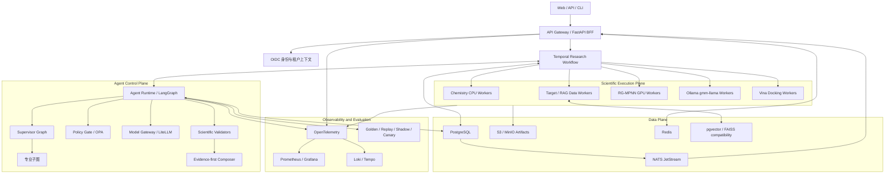
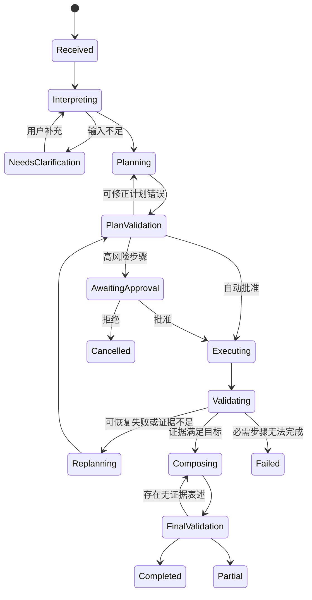

# MedChat 工业级 Agent（Model + Harness）平台设计

**日期：** 2026-08-10

**状态：** 已确认，待分阶段实施

**目标形态：** 内部多用户科研平台，约 15 名在线用户

**自主程度：** 高自主规划与重规划，风险分级审批

**终局方向：** 完整平台化、分阶段迁移

## 1. 背景与目标

MedChat 已具备 `SupervisorAgent`、路由、规划器、工作流执行器、统一工具结果、验证器、事件、SQLite 状态、长期记忆和科研验收集等基础能力。当前主要限制不是缺少组件，而是这些组件仍处于单进程、本地状态和兼容执行链阶段，动态数据流、长任务恢复、模型边界、事件终态和科研声明溯源还不够统一。

本设计将 MedChat 演进为工业级计算药物化学 Agent 平台，使其能够：

- 理解并拆解复杂科研目标；
- 动态选择专业 Agent 和科学能力；
- 在工具结果变化或失败后重新规划；
- 保证下游步骤真实消费上游结构化输出；
- 对长任务执行暂停、恢复、取消、审批和幂等重试；
- 保留模型、工具、输入、证据、warnings 和 artifacts 的完整 provenance；
- 在依赖缺失、输入无效或证据不足时明确失败；
- 禁止伪造 pIC50、ADMET、binding energy、docking score、文献或实验结论。

本项目不从零实现通用 Agent 基础设施。通用能力采用成熟组件，MedChat 只维护计算药物化学领域契约、工具适配、科学验证、证据账本和科研验收规则。

## 2. 已确认的架构决策

1. 平台面向约 15 名内部在线用户，不按公开互联网 SaaS 的初始规模设计。
2. Agent 允许高自主理解、规划、专业 Agent 委派和有限重规划。
3. 采用风险分级人工审批：普通性质计算自动执行；真实 docking、大批量生成、模型训练、外部下载和写操作需要审批。
4. 外部模型采用主模型与备用模型路由；只负责理解、规划、解释和总结。
5. 本地 `gmm-llama:latest` 独占候选分子生成，不被外部主模型替代。
6. 科学结果只由 RDKit、RG-MPNN、AutoDock Vina、靶点数据库等真实工具产生。
7. 终局采用平台化架构，但按可独立上线和回滚的阶段迁移，不一次性重写。
8. 初始容量按 3–5 个并发长任务设计，通过独立 Worker 横向扩容。

## 3. 终局架构



### 3.1 Temporal 与 LangGraph 的边界

- **Temporal 管理任务生命期：** 长任务、计时器、重试、取消、心跳、人工审批等待和基础设施故障恢复。
- **LangGraph 管理认知状态：** 意图理解、动态规划、专业 Agent 委派、根据观察重规划、上下文压缩和结束条件。
- LangGraph 节点不得直接运行 Vina、训练任务或大型 RDKit 批处理，只能产生结构化 `ToolInvocation`。
- Temporal Activity 执行工具并返回 `ToolObservation`，然后由 Agent Runtime 更新认知状态。
- 大型文件不进入 Temporal history 或模型上下文，只保存 artifact ID、摘要和哈希。

### 3.2 服务拆分原则

终局按故障和资源边界拆分：

- `api-gateway`
- `agent-runtime`
- `model-gateway`
- `event-gateway`
- `chemistry-worker`
- `target-data-worker`
- `activity-gpu-worker`
- `molecule-generation-worker`
- `docking-worker`

不得将每个 RDKit 函数或每个小工具拆成独立微服务。

## 4. Agent Harness

### 4.1 生命周期



终态含义：

- `completed`：所有必需目标都有可接受证据；
- `partial`：完成部分真实计算，其他部分明确不可用；
- `failed`：核心输入无效或必需能力无法完成；
- `rejected`：权限或策略拒绝；
- `cancelled`：用户取消或拒绝审批。

“工作流结束”不能单独触发 `completed`。

### 4.2 ResearchRunState

统一状态至少包括：

- 身份：`run_id`、`trace_id`、tenant、project、user、conversation；
- 请求：原始 prompt、标准化意图、科研目标、分子/靶点输入、约束；
- 控制：状态、活跃 Agent、风险、预算、审批和取消状态；
- 执行：计划版本、步骤依赖、调用和观察；
- 科研：evidence ledger、accepted/rejected claims、warnings 和不确定性；
- 输出：artifacts、最终响应和终态摘要。

只持久化结构化决策摘要，不保存模型隐藏思维链。

### 4.3 动态计划与 PlanCompiler

模型输出 `PlanDraft`，确定性的 `PlanCompiler` 编译为 DAG。每个步骤必须包含：

- `step_id`、目标、capability；
- 依赖列表；
- `input_bindings`；
- 版本化输出契约；
- required/optional；
- 超时、重试、审批和资源配置；
- 完成条件。

`PlanCompiler` 必须验证 DAG 无环、capability 已注册、输入输出类型兼容、下游绑定真实引用上游输出、风险与预算允许、路径和网络访问受控。

模型只能选择 capability，例如 `molecule.generate`、`molecule.properties`、`target.structure.search`、`docking.execute`，不能调用任意工具名、Shell 或 Python。

### 4.4 专业 Agent

终局专业子图包括：

- Chemistry Agent；
- Target Intelligence Agent；
- Molecular Design Agent；
- Activity Agent；
- Docking Agent；
- Knowledge Agent；
- Scientific Reviewer。

专业 Agent 使用 `AgentTaskEnvelope` 与 `AgentProposal` 交接，不通过自由聊天传递科学事实，也不直接生成最终用户答案。

### 4.5 高自主边界

Agent 可以拆解、并行、重规划、缩小候选集和请求用户补充，但不能绕过策略、修改工具数值、将 demo/fallback 描述为真实、无限重试或自行产生科学指标。

初始默认限制：最多 3 次重规划、20 个工具步骤、8 次外部规划模型调用、单次生成不超过 50 个候选、单用户最多 1 个并发 docking 长任务。

## 5. 工具、证据与科研声明

### 5.1 标准工具协议

`ToolInvocation` 至少包含 capability、解析后的工具与版本、输入契约、输入摘要、幂等键、超时、资源配置、输出契约和 artifact 策略。

`ToolObservation.status` 使用受控枚举：

```text
succeeded | partial | failed | unavailable |
invalid_input | rejected | cancelled
```

返回必须保留 `data`、warnings、errors、evidence、artifacts、quality 和 provenance。provenance 至少记录工具/模型名和版本、模型哈希、demo/fallback 状态、开始结束时间及运行环境。

### 5.2 Evidence Ledger

每条 `ScientificClaim` 绑定一个或多个 evidence ID，记录值、单位、主体、可信度、不确定性、验证状态和是否允许进入最终响应。

没有 evidence 的数值声明在最终校验时被拒绝，并转换为明确的不可用说明。

### 5.3 防止数值二次篡改

响应模型只引用 claim placeholder，例如 `{{claim:mw_aspirin}}`。确定性渲染器在模型完成语言组织后注入真实数值，模型不能直接改写工具数值。

## 6. 模型层

### 6.1 逻辑角色

- `intent-classifier`
- `research-planner-primary`
- `research-planner-backup`
- `response-composer`
- `embedding-model`
- `molecule-generator`（固定本地 `gmm-llama:latest`）

逻辑角色可映射到相同或不同物理模型。所有外部模型经 LiteLLM Gateway 调用，密钥只来自运行时 Secret，不进入日志或报告。

### 6.2 模型调用契约

`ModelCallEnvelope` 包含角色、任务类型、prompt ID/version、响应 schema、上下文引用、超时、数据分类和预算。结果记录 provider、model、deployment、schema 状态、fallback、重试、延迟、token、成本、prompt/output hash，但不记录密钥。

### 6.3 Fallback 规则

- 网络超时、429、5xx：允许切换备用模型；
- schema 非法：同模型修复一次，再切备用一次；
- 认证失败、策略拒绝：立即终止；
- 科学模型或工具缺失：不得由聊天模型替代；
- `gmm-llama` 不可用：分子生成失败或 partial；
- RG-MPNN 权重缺失：活性 unavailable，不生成模拟 pIC50。

所有 fallback 必须进入 provenance 和 warnings。

### 6.4 Prompt 与上下文

Prompt 进入版本化 registry，包含输入/输出 schema、允许能力、禁止声明、few-shot 和对应评测集。升级必须通过 golden、replay 和注入测试。

上下文分为 policy、current run、validated evidence 和 retrieved knowledge。RAG 文本始终视为不可信数据，不能覆盖系统策略。大型科学文件只传 artifact 摘要。

### 6.5 长期记忆

允许用户偏好、用户确认的项目事实、工具环境经验和带真实 evidence 的科研结论。模型推断、失败结果、凭据和完整聊天默认不写长期记忆。写入经过 `MemoryProposal → Policy → Validator`。

### 6.6 分子生成隔离

本地生成服务执行：

```text
GenerationRequest → gmm-llama → 严格解析 → RDKit 校验
→ canonicalize → 去重 → 约束过滤 → CandidateSet
```

生成模型给出的 QED、ADMET、pIC50 或 docking energy 一律丢弃。前端只渲染 `valid_unique_smiles`。数量不足时在预算内补生成，仍不足则返回 partial。

## 7. 数据、事件和溯源

### 7.1 数据职责

- PostgreSQL：业务与科研审计权威数据；
- Temporal：工作流执行控制权威；
- S3/MinIO：大型 artifacts；
- Redis：缓存、限流、锁和临时会话；
- NATS JetStream：至少一次事件分发与重放；
- pgvector/FAISS：检索索引。

PostgreSQL 核心实体包括 research runs、plan revisions、steps、tool invocations/observations、model calls、evidence、claims、artifacts、approvals、events、outbox、memories 和 evaluations。

观察、证据、审批和审计事件采用 append-only；计划修改新增 revision，不覆盖历史。

### 7.2 Artifact

Artifact 元数据记录类型、对象 URI、媒体类型、大小、SHA-256、产生工具和版本、输入 artifact、保留策略和访问策略。API 不返回机器绝对路径。

内部 provenance 参考 W3C PROV；完整科研任务导出采用 RO-Crate，包含输入、流程、工具/模型版本、参数、结果、artifacts、warnings 和失败步骤。

### 7.3 事件协议

事件包含全局 event ID、schema version、run 内 sequence、tenant/project、run/trace/plan/step、actor、payload 和摘要。事件通过 PostgreSQL transactional outbox 发布到 JetStream，前端按 event ID 与 sequence 去重。

`run.completed` 只能在最终结果和终态已持久化后发布。刷新页面先从 PostgreSQL 回放历史，再接收实时事件。

### 7.4 幂等

幂等键由 tenant、run、step、tool、tool version、标准化输入摘要和 plan revision 组成。相同成功调用复用 observation；transient failure 可重试；invalid/rejected 不自动重试。artifact 使用内容哈希去重。

## 8. 可观测性与评测门禁

OpenTelemetry trace 贯穿 HTTP、Agent、模型、Temporal、Worker、工具、artifact、验证器和最终响应。日志不得包含密钥、Authorization、隐私或大型原始科学文件。

发布评测分层：

1. 单元与契约；
2. 确定性 replay；
3. 真实工具集成；
4. 真实 Agent E2E；
5. shadow；
6. canary；
7. 生产持续抽样。

LLM judge 只评价语言质量，不能裁定科学真实性。

任何以下情况阻止发布：

- 伪造科学指标、文献或实验结论；
- demo/fallback 被描述为真实；
- 无效 SMILES 返回性质；
- 缺 receptor/box 返回结合能；
- 工具未执行却声明真实完成；
- accepted claim 无 evidence；
- 最终数值与 observation 不一致；
- 跨租户数据泄漏；
- API key 出现在日志、报告或 artifact。

建议初始 SLO：任务提交 1 秒内返回 `run_id`；事件 p95 延迟低于 2 秒；已接受任务不因 API 重启丢失；provenance 完整率 100%；PostgreSQL RPO 不高于 15 分钟，平台 RTO 不高于 2 小时。

## 9. 分阶段迁移

### 阶段 0：基线与契约冻结

冻结 API、事件、工具和 Agent 验收基线；确认唯一入口、依赖健康、密钥安全和前端终态行为。

### 阶段 1：科学可信核心

建立版本化 contracts、capability catalog、PlanCompiler、数据绑定、Evidence Ledger、claim validator、确定性渲染和合法候选流水线。此阶段优先解决伪科学结果、无效分子卡片、下游未消费上游输出和 completed 无最终响应。

### 阶段 2：LangGraph Harness

通过 `legacy → shadow → langgraph` 模式迁移 Supervisor。引入专业子图、动态规划、bounded replan、LiteLLM Gateway、Prompt Registry 和风险状态。

### 阶段 3：Temporal 持久执行

通过 `local → temporal` 后端迁移长任务。建立资源队列、心跳、取消、审批、PostgreSQL 状态和对象存储。旧 SQLite 数据只读保留或一次性导入，不长期双写。

### 阶段 4：服务化与 Kubernetes

先容器化单机部署，再迁移 CPU Worker、GPU/Ollama Worker 和 Docking Worker。引入 NATS、MinIO、OPA、OIDC 和 Kubernetes 资源隔离。

### 阶段 5：科研治理与持续评测

完善策略、shadow/canary、在线评测、RO-Crate 导出、数据保留、备份恢复、事故分类和自动发布门禁。

旧链路退役顺序固定为：兼容接口、shadow、canary、新入口默认、保留至少两个稳定发布周期、最后删除旧代码。

## 10. 当前代码迁移映射

| 当前组件 | 终局角色 |
|---|---|
| `SupervisorAgent` | 兼容 façade，逐步迁入 LangGraph Supervisor |
| `HybridSkillRouter` | 初始 Intent Classifier |
| `TaskPlanner` | Plan Template Library 与 PlanCompiler 输入 |
| `WorkflowCatalog` | capability catalog 初始来源 |
| `WorkflowPolicy` | OPA enforcement adapter 初始实现 |
| `WorkflowOrchestrator` | Temporal workflow bridge |
| `WorkflowExecutor` | 本地执行后端和 Temporal Activity adapter |
| `ToolRegistry` | capability-to-tool resolver |
| `execute_tool_compat` | 旧工具兼容层，逐步退役 |
| `AgentResultValidator` | Observation Validator 与 Claim Validator |
| SQLite state store | 开发模式保留，生产迁 PostgreSQL |
| `AgentEventBus` | transactional outbox 与 event gateway |
| acceptance runner | replay、release gate、shadow 和 canary 评测入口 |

## 11. 非目标

- 不在第一阶段重写全部业务代码；
- 不让通用 Agent 框架决定科学真实性；
- 不让每个工具成为微服务；
- 不以 LLM 自评代替真实工具与确定性验收；
- 不自动迁移或提交本地模型、数据库、索引和计算产物；
- 不在未建立 shadow/canary 前删除当前执行链；
- 不把外部主模型用于替代本地分子生成或科学模型。

## 12. 成熟组件与自研边界

直接采用：LangGraph、Temporal、LiteLLM、OPA、PostgreSQL、NATS JetStream、MinIO/S3、OpenTelemetry、Kubernetes、W3C PROV 和 RO-Crate。

MedChat 自研：计算药物化学 capability、版本化领域契约、工具适配、科学 Validator、Evidence Ledger、claim 安全渲染、生成后处理和科研验收标准。

## 13. 参考资料

- [LangGraph persistence](https://docs.langchain.com/oss/python/langgraph/persistence)
- [LangGraph interrupts](https://docs.langchain.com/oss/python/langgraph/interrupts)
- [LangGraph subgraphs](https://docs.langchain.com/oss/python/langgraph/use-subgraphs)
- [Temporal documentation](https://docs.temporal.io/)
- [LiteLLM routing](https://docs.litellm.ai/docs/routing)
- [Ollama structured outputs](https://docs.ollama.com/capabilities/structured-outputs)
- [Open Policy Agent](https://www.openpolicyagent.org/docs)
- [NATS JetStream](https://docs.nats.io/nats-concepts/jetstream)
- [OpenTelemetry Python](https://opentelemetry.io/docs/languages/python/instrumentation/)
- [Kubernetes GPU scheduling](https://kubernetes.io/docs/tasks/manage-gpus/scheduling-gpus/)
- [W3C PROV Primer](https://www.w3.org/TR/prov-primer/)
- [RO-Crate specification](https://www.researchobject.org/ro-crate/specification.html)
