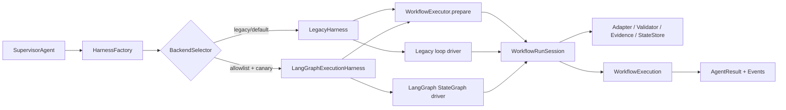

# MedChat 工业级 Agent 阶段 2B：LangGraph 受限真实执行与 Canary 设计

**日期：** 2026-08-11

**状态：** 已确认，实施计划已编写

**上位设计：** `docs/superpowers/specs/2026-08-10-industrial-agent-platform-design.md`

**前置阶段：** `docs/superpowers/specs/2026-08-10-industrial-agent-langgraph-harness-design.md`

## 1. 背景与晋级依据

阶段 2A 已建立框架无关的 `WorkflowHarness`，并使用 LangGraph 对已编译计划执行无工具副作用的 shadow 推演。当前已满足阶段 2B 设计前置条件：

- Agent 全量测试为 `474 passed, 1 skipped`，性能测试显式启用时通过；
- 36/36 个真实 golden 案例的 shadow 控制状态与 legacy 权威结果一致；
- shadow 未重复调用工具，禁止模式命中为 0，未记录 API key 或完整 prompt；
- 热运行 p95 额外耗时低于 100 ms，且保留 1 秒硬超时；
- 清除 harness 配置可立即恢复纯 legacy。

阶段 2B 让 LangGraph 在严格 allowlist 和确定性 canary 下，首次作为低风险工作流的权威调度器。MedChat 已有科学执行、验证、证据和持久化能力仍是唯一业务真相来源。

## 2. 目标与非目标

### 2.1 目标

- 新增 `langgraph_canary` harness 模式，为受允许的低风险工作流调度真实工具。
- 一个请求只选择一个权威后端，确保工具、artifact 和外部副作用不被重复执行。
- 将 `WorkflowOrchestrator.run()` 中的科学步骤语义提取为可复用运行会话，legacy 与 LangGraph 共用同一份实现。
- 保持 Tool Adapter、Validator、Semantic Gate、Candidate Alignment、Evidence Ledger、checkpoint 和事件的现有语义。
- 对 canary 分流、后端选择、工具尝试数、回退决策和耗时进行脱敏记录。
- 通过一个环境变量立即恢复纯 legacy，不改变 Web/API/AgentResult 公共契约。

### 2.2 非目标

- 不由 LangGraph 执行分子生成、hit-to-lead、target-driven design、docking、模型训练、外部下载或写操作。
- 不引入 LLM 动态规划、自动重规划、预制 ReAct Agent 或 LLM 自评真实性。
- 不引入 LangGraph checkpointer，不建第二套状态数据库。
- 不引入 Temporal、PostgreSQL、NATS、MinIO、OPA、OIDC 或 Kubernetes。
- 不修改前端、WebSocket 公共事件格式、科学工具模型边界或 golden case 标准。
- 不在本批次重写 `_DelegatedWorkflowExecutor` 与 specialist delegation 循环；该 API 入口继续作为 legacy control cohort。

## 3. 方案选择

本阶段采用“受限 canary 执行”。不采用全量 LangGraph 接管，因为它会同时改变生成、docking 和长任务恢复语义；也不直接迁移 Temporal，因为需要先证明 LangGraph 真实调度与已有科学门禁兼容。受限 canary 能使风险可测量、可回滚，且不从零重写科学执行器。

## 4. 总体架构



`WorkflowRunSession` 保留当前 `WorkflowOrchestrator.run()` 的权威科学语义，但将其分解为 `start() -> execute_step(index) -> finish()` 生命周期。LangGraph 只决定节点推进；它不直接解析 SMILES、调用旧工具函数、生成 evidence 或组装最终答案。

本批 canary 只适用于实现 `prepare()` 和 session driver 协议的直接 `WorkflowExecutor`，覆盖前台聊天 `Supervisor.execute()` 与科学验收 runner。`Supervisor.run()` 中现有 `_DelegatedWorkflowExecutor` 显式返回 `unsupported_delegated_executor`，继续走 legacy，不被意外选入 canary。在 LangGraph 成为默认后端前，delegated 路径必须通过后续独立设计收敛到同一 session 语义。

## 5. 核心组件

### 5.1 `PreparedWorkflow`

`WorkflowExecutor.prepare()` 将计划、preflight、权限过滤和请求级 EventBus 构建收敛为准备结果，包含 plan、compiled plan、context、policy、filtered tools、request orchestrator、event bus 和 idempotency key。Preflight 失败仍返回现有 `WorkflowExecution`，不进入任何 driver。Legacy 与 LangGraph 必须消费同一份准备结果，防止工具授权和计划编译分叉。

### 5.2 `WorkflowRunSession`

Session 拥有 `WorkflowState`、outputs、ToolResult 序列、Evidence Ledger、reused/skipped/checkpoint warning/semantic evidence、当前 step index、工具尝试数和终止原因。

- `start()` 只能调用一次，建立 run 并发布 task/planning 事件；
- `execute_step(index)` 每个 index 最多一次，复用当前绑定、语义门、checkpoint、适配、验证、候选对齐、证据登记和持久化逻辑；
- `finish()` 只能调用一次，组装 AgentResult、发布唯一终态事件并写入 run 终态；
- 重复生命周期调用以结构化内部错误失败，不重复调用工具。

`WorkflowOrchestrator.run()` 保留为公共兼容方法，内部创建 session，用普通 Python 循环推进，然后 finish。

### 5.3 `LangGraphExecutionHarness`

Harness 为已准备计划构建 `StateGraph`。每个节点确认 step index，调用 `session.execute_step(index)`，然后向 graph state 追加 step ID、控制结果和终止标志。

Graph state 只保留 `trace_digest`、`plan_fingerprint`、`visited_steps`、`step_outcomes`、`terminal` 和 `terminal_reason`。工具输入输出、完整 prompt、候选分子、artifact 内容和凭据不进入 graph state。Graph 结束后只能通过 `session.finish()` 产生权威 `WorkflowExecution`。

### 5.4 `LangGraphCanarySelector`

后端选择顺序固定：

1. `AGENT_HARNESS_MODE` 不是 `langgraph_canary` 时使用已有 legacy/shadow 行为；
2. LangGraph 依赖不可用时回到 legacy 并记录配置 warning；
3. workflow 不在内置安全 allowlist 时使用 legacy；
4. executor 不实现受支持的 prepare/session 协议时使用 legacy，记录 `unsupported_delegated_executor`；
5. 使用 `idempotency_key` 或 `trace_id` 的 SHA-256 稳定分桶；
6. bucket 小于 `AGENT_LANGGRAPH_CANARY_PERCENT` 时选择 LangGraph，否则选择 legacy。

`AGENT_LANGGRAPH_CANARY_PERCENT` 只允许 `0–100` 的整数，默认为 `0`。非法值使 canary 禁用并记录 warning，不得意外开启全量。首批内置 allowlist 为：

```text
admet_assessment
activity_prediction
reverse_target_prediction
target_database_search
rag_search
```

`comprehensive_evaluation`、`molecular_design`、`hit_to_lead_optimization`、`target_driven_design` 和 `docking_simulation` 明确排除。不允许用环境变量扩大 allowlist；扩大范围必须修改版本化代码与测试。

## 6. 单次执行、回退与幂等

Canary selector 在任何工具调用前一次性选定后端。被选中的 LangGraph 请求不再运行 legacy 作实时对照；等价性通过 replay、contract fixture 和 control cohort 评估。

- 依赖、配置、计划或 graph 编译在 `session.start()` 前失败：允许 legacy 回退，记录 `fallback_before_execution=true`。
- `session.start()` 后但工具尝试数仍为 0 时发生 graph 错误：允许由 legacy loop driver 继续推进同一 session，不创建新 trace，不重发 task/planning 事件，并记录 `fallback_before_execution=true`。
- 工具尝试数大于 0 后任何异常：禁止自动运行 legacy，session 如实以 `failed` 终结。

“工具尝试”在进入 `execute_tool_compat` 前立即计数，即使工具抛异常也不得通过回退触发第二次执行。

`SQLiteAgentStateStore` 继续作为唯一权威状态库。`idempotency_key` 在分流前解析，重复请求复用已有终态结果。Session 继续使用 workflow/tool/model version 和 input hash 兼容检查。本阶段不保证进程内 graph state 恢复；重启后由 MedChat checkpoint 重建 session 并复用已成功步骤。

## 7. 事件、结果与持久化

Legacy 和 LangGraph 都由 `WorkflowRunSession` 发布现有 task/planning/tool/terminal 事件，每个 run 只发布一个 terminal event。Graph 节点、canary bucket 和 fallback 不注入公共 WebSocket 事件。

Canary 运行在 `AgentResult.metadata["harness_execution"]` 记录：

```text
backend
backend_version
selection_reason
canary_bucket
plan_fingerprint
tool_attempt_count
fallback_before_execution
elapsed_ms
```

metadata 必须通过 `redact_sensitive()`，不记录完整 prompt、工具输入输出、环境变量值或绝对 artifact 路径。Supervisor 的 metadata 持久化路径从只识别 `harness_shadow` 扩展为同时识别 `harness_execution`；持久化失败仍只产生 warning。

## 8. 安全和错误处理

本阶段 allowlist 工具必须无用户/模型/远程索引写入，不启动长时间外部进程，不创建高成本 artifact，不需人工审批，且已有明确 ToolResult 契约与真实性检查。如果未来增加副作用，必须在同一变更中移出 allowlist。

- 计划未授权、工具缺失或编译失败：按现有 preflight 错误返回；
- 科学前置门失败：下游保持 `skipped_precondition`，整体按现有 partial/failed 语义结束；
- required 工具失败：停止后续节点；optional 失败：按现有 `continue_on_error` 规则决定；
- graph 异常：按工具尝试数决定是否回退，绝不变成成功文本；
- metadata 持久化失败：权威结果不变，追加脱敏 warning。

## 9. 可观测性与测试矩阵

必须记录 backend 选择及原因、workflow 状态分布、tool attempt/checkpoint reuse、禁止回退、graph runtime error、p50/p95、终态事件完整率、provenance/evidence/candidate alignment 和 forbidden pattern 通过率。

TDD 至少覆盖：

1. canary percent 非法时 fail closed，0% 永不选中，100% 对 allowlist 工作流始终选中。
2. 同一 idempotency key 始终分到同一 bucket，报告不包含 key 原文。
3. 非 allowlist 工作流在 100% 配置下仍走 legacy。
4. delegated executor 在 100% 配置下仍走 legacy，且不重复调用 specialist 工具。
5. legacy 重构前后的 ToolResult、AgentResult、事件序列和 checkpoint 恢复兼容。
6. LangGraph 的单步、多步、required failure、optional failure 和语义门与 legacy fixture 一致。
7. 每个工具最多调用一次；graph 节点重入被 session 拒绝。
8. graph 在工具前失败可回退，工具后失败不回退且调用数仍为 1。
9. 重启后已成功 checkpoint 可被 canary 复用，不重新调用工具。
10. `harness_execution` 持久化失败不修改科学结果。
11. metadata、日志和报告不包含 API key、Authorization、完整 prompt 或绝对 artifact 路径。
12. contract 保持 34/34，canary 探针不改变旧 case 数。
13. golden real 重复 3 轮无新 hard failure，低风险案例 backend/provenance/truth checks 完整。

## 10. 配置、上线和回滚

```text
AGENT_HARNESS_MODE=legacy
AGENT_HARNESS_MODE=shadow
AGENT_HARNESS_MODE=langgraph_canary
AGENT_LANGGRAPH_CANARY_PERCENT=0
```

`.env.example` 只增加无凭据的安全默认示例。建议先保持 legacy 运行全量回归，再在测试环境以 canary 100% 验证 allowlist，最后内部环境按 `5% -> 25% -> 50% -> 100%` 递增。任何工具重复、证据丢失、终态事件缺失或科学硬失败立即回到 `legacy`。

## 11. 阶段完成与阶段 3 入口条件

阶段 2B 完成必须同时满足：

- 默认 legacy 和公共契约完全兼容；
- 直接执行入口中的 allowlist 工作流在 100% 测试 canary 下工具调用数与 legacy 基线一致；
- 终态事件、provenance 和 evidence-backed claim 完整率为 100%；
- 重复工具调用、伪造科学结果和凭据泄漏均为 0；
- contract、replay、real 与三轮稳定性验收无新 hard failure；
- canary 配置错误时 fail closed 到 legacy，且可不改代码立即回滚；
- 完成单进程重启与 checkpoint 复用验证。

满足后才进入阶段 3 Temporal 持久执行设计。阶段 3 将解决跨进程 durable graph state、长任务 heartbeat/取消/审批、资源队列、PostgreSQL 和对象存储。

## 12. 实施文件边界

### 12.1 预计新增

- `src/agent/runtime/run_session.py`
- `src/agent/harness/canary.py`
- `src/agent/harness/langgraph_execution.py`
- `tests/agent/test_workflow_run_session.py`
- `tests/agent/test_harness_canary.py`
- `tests/agent/test_langgraph_execution_harness.py`

### 12.2 预计修改

- `src/agent/runtime/workflow_executor.py`
- `src/agent/orchestrators/workflow.py`
- `src/agent/harness/base.py`
- `src/agent/harness/factory.py`
- `src/agent/harness/__init__.py`
- `src/agent/supervisor.py`
- `src/agent/evaluation/scientific.py`
- `scripts/run_agent_acceptance.py`
- `.env.example`
- 必要的现有 `tests/agent/` 兼容测试。

不修改前端、WebSocket 契约、科学工具实现、数据库 schema 或真实科研资产。
