# MedChat 工业级 Agent 阶段 3A：Temporal 对接长任务 Canary 设计

**日期：** 2026-08-12
**状态：** 已确认，待实施计划
**前置阶段：** `docs/superpowers/specs/2026-08-11-industrial-agent-langgraph-canary-design.md`
**目标分支：** `codex/industrial-agent-temporal-docking-canary`

## 1. 背景与目标

阶段 2B 已允许 LangGraph 在固定 allowlist 和确定性 canary 下调度低风险工作流，同时继续由 `WorkflowRunSession`、统一 `ToolResult`、Validator、Evidence Ledger 和真实工具产物决定科学结论。当前默认仍是 legacy、canary 比例为 0%，且已有明确的一键回滚路径。

现有长任务运行时仍由单进程 `ThreadPoolExecutor` 和 SQLite 驱动。它可以保存任务记录，却不能在 Web 进程重启后继续执行任务，也没有跨进程 heartbeat、可靠取消、资源队列和外部执行历史。现有 `/api/docking/submit` 还在 HTTP 请求生命周期内保存临时上传文件并同步等待对接完成，无法直接承载持久异步执行。

阶段 3A 的目标是建立第一个可回滚的 Temporal 持久执行闭环，并只迁移真实分子对接这一类长任务。该阶段必须证明：

1. API 在一秒内返回稳定 `task_id`；
2. Web 进程重启不丢失已经由 Temporal 接受的任务；
3. heartbeat、取消和终态可以被查询和追踪；
4. Temporal 的 Activity 重放或故障恢复不会重复运行 Vina；
5. pose、binding energy、warnings、artifacts 和 provenance 仍来自现有真实工具与 Validator；
6. Temporal 不可用时只能在 workflow 启动前回落 local，启动后禁止回落重跑；
7. 默认行为保持 `local`、canary 0%，不改变现有同步对接接口。

## 2. 范围

### 2.1 本阶段包含

- 框架无关的 `TaskRuntimeBackend` 协议；
- 现有 `TaskManager` 的 `LocalTaskBackend` 适配；
- 可选的 `TemporalTaskBackend`；
- 仅允许 docking task 的稳定 canary selector；
- 新的异步对接任务入口、任务查询和取消接口；
- 任务归属的输入暂存、哈希清单和保留期清理；
- docking Temporal Workflow、Activity 和独立 worker 入口；
- Vina 子进程所有权、heartbeat、取消和 completion manifest；
- SQLite 查询投影与追加式 schema 迁移；
- 结构化任务事件、指标和脱敏日志；
- 单元、契约、Temporal 集成、真实 Vina 和故障演练测试。

### 2.2 本阶段不包含

- PostgreSQL、Redis、NATS、MinIO 或其他对象存储；
- Kubernetes、容器编排或多节点 worker 调度；
- 全部 Agent workflow、Ollama 生成、RG-MPNN 或靶点检索迁移；
- LangGraph graph state 持久化到 Temporal；
- 人工审批平台和 OPA；
- 删除现有同步 `/api/docking/submit`；
- 长期 SQLite/Temporal 双写架构；
- 科学工具算法、Vina 参数或 docking 评分逻辑重写。

## 3. 方案选择

### 3.1 采用：独立 Temporal 执行后端

Web/API 通过统一任务门面提交任务，`local` 与 `temporal_canary` 后端并存。Temporal worker 独立运行，Workflow 管理生命周期，Activity 复用现有 docking service 和科学验证。

该方案能隔离 Web 与长任务资源，允许 worker 和 Web 独立重启，并保持现有科学执行逻辑不被重新实现。

### 3.2 不采用：Web 进程内嵌 Worker

内嵌 Worker 部署较少，但 Web reload、进程重启和请求资源竞争会影响长任务；它也不能证明真正的执行平面隔离。

### 3.3 不采用：一次迁移完整 Agent 工作流

一次迁移会同时改变 LangGraph、分子生成、对接、持久化、事件和恢复语义，无法把故障归因到单一边界，也不具备安全回滚条件。

## 4. 总体架构

```mermaid
flowchart LR
    UI["Docking UI / API Client"] --> API["FastAPI async docking endpoint"]
    API --> STAGE["Task-owned input staging"]
    STAGE --> FACADE["TaskRuntime facade"]
    FACADE --> SELECTOR["Deterministic backend selector"]
    SELECTOR -->|local| LOCAL["LocalTaskBackend"]
    SELECTOR -->|temporal canary| TEMP["TemporalTaskBackend"]
    TEMP --> SERVER["Temporal Server"]
    SERVER --> WORKER["Dedicated docking worker"]
    WORKER --> WF["DockingWorkflow"]
    WF --> ACT["Docking Activity"]
    ACT --> PROC["Managed docking process"]
    PROC --> SERVICE["Existing MolecularDockingService"]
    SERVICE --> VINA["AutoDock Vina / Meeko / ADFRsuite"]
    VINA --> VALIDATOR["ToolResult adapter + scientific Validator"]
    LOCAL --> PROJECTION["SQLite task projection and events"]
    WF --> PROJECTION
    ACT --> PROJECTION
    VALIDATOR --> PROJECTION
    PROJECTION --> API
```



Temporal 只管理调度、history、timeout、heartbeat、取消和 workflow 终态。它不能计算或总结 binding energy，也不能跳过 `ToolResult` 适配与 Validator。

## 5. 组件边界

### 5.1 `TaskRuntimeBackend`

新增异步后端协议，公开以下能力：

- `async submit(submission) -> TaskRecord`
- `async get(task_id) -> TaskRecord`
- `async list(query) -> list[TaskRecord]`
- `async cancel(task_id, reason) -> TaskRecord`
- `async health() -> BackendHealth`

调用方不能访问 `ThreadPoolExecutor`、Temporal Client 或 Temporal Workflow Handle。所有后端返回相同的任务契约。

### 5.2 `LocalTaskBackend`

现有 `TaskManager` 保持本地执行语义，并由 adapter 实现统一协议；阻塞数据库和执行器调用通过现有 threadpool 边界接入异步协议。默认配置继续选择 local。local 后端不声称提供进程重启恢复；这一限制必须进入 health 和任务 provenance。

异步 docking 任务即使分配到 local，也必须使用与 Temporal Activity 相同的 Managed docking process 和任务级取消令牌。这样 local 与 Temporal 具有一致的进程终止语义，但 local 仍不承诺 Web 进程重启后的执行恢复。

### 5.3 `TemporalTaskBackend`

Temporal SDK 使用惰性导入。SDK 未安装、配置非法、服务不可达或 namespace 不可用时，后端 health 为 unavailable。只有在 workflow 尚未被 Temporal 接受前才允许回落 local。

Temporal workflow ID 固定为 `medchat-docking-{task_id}`。`task_id` 同时是 API 幂等标识，重复提交返回已有记录；冲突策略禁止启动第二个同 ID workflow。

### 5.4 `DockingWorkflow`

Workflow 只包含确定性控制逻辑：

1. 调用投影 Activity 写入 running 状态；
2. 执行可重试的输入清单检查；
3. 调用 docking Activity；
4. 接受取消并等待 Activity 确认子进程退出；
5. 调用投影 Activity 写入唯一终态；
6. 返回结构化任务结果。

Workflow 不直接读取文件、不连接 SQLite、不调用 RDKit/Vina，也不读取运行时环境变量。

### 5.5 Docking Activity

Activity 负责非确定性 I/O 和科学工具调用。它按以下阶段报告 heartbeat：

```text
environment_check
input_verification
receptor_preparation
ligand_preparation
vina_running
result_parsing
scientific_validation
artifact_commit
```

heartbeat 只包含 phase、attempt、elapsed time 和脱敏进度。它不得包含 API key、完整用户 prompt、SMILES 原文或未经脱敏的机器路径。

### 5.6 Managed docking process

Vina 执行由 Activity 拥有的受控子进程承载。进程必须使用独立进程组，Activity 取消或 worker shutdown 时先终止进程树，再确认退出并清理不完整输出。

执行器使用任务级排他所有权锁，禁止同一 `task_id` 同时存在两个 Vina 进程。阶段 3A 只运行一个 docking task queue 和一个并发槽，从部署边界上进一步限制重复执行风险。

### 5.7 SQLite 查询投影

SQLite 继续服务 API 查询，但不冒充 Temporal history。现有 `tasks` 表通过追加迁移增加：

- `backend`
- `external_workflow_id`
- `phase`
- `progress`
- `attempt`
- `heartbeat_at`
- `error_code`
- `warnings_json`
- `input_manifest_path`
- `provenance_json`

新增 `task_events` 表，事件包含单调 sequence 和 `is_terminal`。数据库使用唯一索引保证每个任务最多一个 `is_terminal=1` 事件。迁移只能增加列、表和索引，不删除或改写已有任务记录。

### 5.8 投影修复器

`TemporalTaskBackend.get()` 在发现 Temporal 任务投影缺失、heartbeat 过旧或非终态记录长期未更新时，使用 workflow ID 查询 Temporal execution 状态和只读 workflow snapshot，再以 compare-and-set 方式修复 SQLite。独立 reconciliation 命令可批量扫描 temporal backend 的非终态任务并执行同一逻辑。

投影修复不能重启 workflow、调用 Vina 或修改已经存在的终态。Temporal 无法查询时返回最后一次已知投影并附加 `projection_stale` warning，不将未知状态伪造成 failed 或 succeeded。

## 6. API 与兼容性

### 6.1 新增异步入口

新增 `POST /api/docking/tasks`。请求参数沿用现有单配体 docking 参数，但返回 HTTP 202 和任务记录，不同步等待 Vina。

现有 `POST /api/docking/submit` 保持原响应与同步行为，避免 canary 分桶导致同一接口出现两种响应契约。后续阶段在前端完全迁移到异步入口并经过两个稳定发布周期后，才讨论兼容接口退役。

### 6.2 查询与取消

- `GET /api/tasks/{task_id}` 返回状态、phase、进度、warnings、artifacts 和脱敏 provenance；
- `POST /api/tasks/{task_id}/cancel` 接受取消原因并返回最新任务记录；
- `GET /api/tasks/{task_id}/events` 返回有序事件；
- 运维 health 只返回 Temporal 是否配置、是否可达、namespace、task queue 逻辑名和 worker freshness，不返回凭据或敏感连接参数。

接口沿用现有管理鉴权和 API response helper。对接任务的用户级访问控制不在本阶段扩大；所有新增管理查询和取消能力至少保持当前 `/api/tasks*` 的管理鉴权强度。

## 7. 输入暂存与 Artifact

异步任务不能依赖 `NamedTemporaryFile` 的请求生命周期。API 校验上传大小和扩展名后，将输入原子写入：

```text
scratch/task_inputs/<task_id>/inputs/
```

同目录写入版本化 `input_manifest.json`，包含：

- schema version；
- 任务类型；
- receptor/ligand 相对路径；
- 文件大小和 SHA-256；
- ligand input type；
- docking box 和 Vina 参数；
- 创建时间；
- config hash。

读取端必须将相对路径解析到任务根目录并再次校验 containment、大小和 SHA-256，拒绝路径穿越、软链接逃逸和任务间文件引用。

成功输出仍由现有 docking 工作目录和 artifact 契约管理。任务根目录额外写入原子 `completion_manifest.json`，记录输入/config 哈希、工具版本、pose 路径与哈希、pose count、最佳能量、Validator 状态和完成时间。只有 completion manifest 与实际 artifact 同时通过校验时才允许复用结果。

失败和取消产生的不完整 pose 不得进入 artifacts。输入和失败产物按配置保留期清理；清理任务不能删除 running 或 cancel_requested 任务的目录。

## 8. Backend 选择与回滚

配置面为：

```text
MEDCHAT_TASK_BACKEND=local|temporal_canary
MEDCHAT_TEMPORAL_CANARY_PERCENT=0
MEDCHAT_TEMPORAL_ADDRESS=127.0.0.1:7233
MEDCHAT_TEMPORAL_NAMESPACE=default
MEDCHAT_TEMPORAL_DOCKING_QUEUE=medchat-docking
MEDCHAT_TEMPORAL_DOCKING_CONCURRENCY=1
MEDCHAT_TASK_STAGING_ROOT=scratch/task_inputs
```

selector 仅接受完整整数 0–100，并使用由 API 在分流前生成的 `task_id` 做稳定 SHA-256 分桶。只有 task type 为 docking、输入清单完成、后端 health 可用且配置命中时才选择 Temporal。非法配置、未知 task type 和缺少稳定 key 均 fail closed 到 local，并记录不含原始 key 的运维 warning。

回滚通过设置 `MEDCHAT_TASK_BACKEND=local` 或 canary 0% 完成。该操作只停止新的 Temporal 分流。已经被 Temporal 接受的 workflow 必须继续由 Temporal 完成、失败或取消，禁止切回 local 重跑。

## 9. 状态机

公开状态为：

```text
queued -> running -> succeeded
                  -> failed
                  -> cancel_requested -> canceled
                  -> timed_out
```

内部重试不把任务退回 queued，而是更新 attempt、phase、heartbeat 和 warning。所有状态写入使用 compare-and-set 语义：终态不可被后续 heartbeat 或异常覆盖。

`cancel_requested` 表示系统已经接受请求但外部进程尚未确认退出。只有 Managed docking process 确认进程树退出后，任务才进入 `canceled`。取消失败或超时必须保留错误和告警，不得提前显示取消成功。

## 10. 重试、幂等与重复执行防护

Temporal Activity 按至少一次执行设计。重试分为：

- 输入清单读取、SQLite 投影、事件写入等幂等 Activity：有限指数退避重试；
- 无效输入、哈希不匹配、缺依赖、Validator 拒绝和 Vina 正常失败：不可重试；
- Vina 运行：禁止普通自动重试。

worker 异常后的恢复性 Vina 重试必须同时满足：

1. 旧进程所有权锁已经释放；
2. 系统确认旧进程树不存在；
3. 不存在有效 completion manifest；
4. 不存在已通过校验的 pose artifact；
5. attempt 未超过恢复上限。

如果有效 completion manifest 已存在，Activity 复用经过再次验证的结果，不调用 Vina。如果无法证明旧进程已经退出，任务保持 failed 或需要运维处理，不能冒险重复计算。

## 11. 科学可信边界

Temporal Workflow 和外部主模型均不得创建科学数值。Activity 的原始返回仍必须经过：

```text
MolecularDockingService
-> execute_tool_compat / ToolResult contract
-> docking domain validator
-> evidence/provenance registration
-> task result projection
```

任务只有在以下条件全部满足时才可 succeeded：

- Vina 真实执行或有效 completion manifest 被复用；
- pose count 大于 0；
- binding energy 是从 Vina 输出解析的有限数值；
- pose 文件存在且哈希可计算；
- `demo_mode` 和 fallback 未被当作真实结果；
- ToolResult provenance、warnings、artifacts 和 Validator 状态完整。

缺失 Vina、Meeko、ADFRsuite、receptor、ligand 或 docking box 必须 failed，不返回 kcal/mol 数值。

## 12. 错误分类

错误使用稳定 code，而不是依赖文本判断：

- `TASK_INPUT_INVALID`
- `TASK_INPUT_HASH_MISMATCH`
- `TASK_BACKEND_UNAVAILABLE`
- `TEMPORAL_START_FAILED`
- `TEMPORAL_WORKER_UNAVAILABLE`
- `TASK_HEARTBEAT_TIMEOUT`
- `TASK_CANCEL_TIMEOUT`
- `DOCKING_ENVIRONMENT_UNAVAILABLE`
- `DOCKING_PROCESS_FAILED`
- `DOCKING_PROCESS_OWNERSHIP_UNCERTAIN`
- `DOCKING_ARTIFACT_INVALID`
- `SCIENTIFIC_VALIDATION_FAILED`
- `TASK_PROJECTION_FAILED`

错误消息和 warning 必须经过现有脱敏器。路径只返回仓库相对或 artifact 逻辑路径。

## 13. 可观测性

每个任务至少保留：

- task ID、trace ID、backend 和 workflow ID 指纹；
- task queue、phase、attempt、heartbeat age；
- submit、queue、execution、cancel 和总耗时；
- input/config/tool version hash；
- fallback-before-start 和 duplicate-execution-prevented 计数；
- terminal event 数量；
- artifact hash 和 Validator 状态。

初始运行指标包括：

- `task_submit_latency_ms`
- `task_backend_selected_total`
- `temporal_workflow_start_failed_total`
- `task_heartbeat_age_seconds`
- `task_cancel_latency_ms`
- `docking_process_attempt_total`
- `docking_duplicate_execution_prevented_total`
- `task_terminal_event_total`
- `docking_artifact_validation_total`
- `task_duration_ms`

本阶段使用结构化日志、SQLite 任务事件和验收报告承载指标，不引入新的监控服务。

## 14. 依赖与运行方式

新增可选依赖文件：

```text
requirements-agent-temporal.txt
```

固定 `temporalio==1.30.0`。该版本发布于 2026-07-02，要求 Python 3.10+，并提供 Windows x86-64 wheel。通用 `requirements.txt` 和 LangGraph 可选依赖文件保持不变。

Temporal server 与 docking worker 独立于 FastAPI 启动。worker 入口只注册本阶段 Workflow 和 Activity，不自动加载无关 Agent 工具。

参考资料：

- Temporal Python SDK API：<https://python.temporal.io/>
- Temporal Python SDK PyPI：<https://pypi.org/project/temporalio/>

## 15. TDD 与测试矩阵

### 15.1 单元测试

- backend 配置和稳定 canary 分桶；
- 非 docking 任务永不进入 Temporal；
- SDK 缺失或连接不可用时启动前回落；
- TaskRecord 新字段和旧 SQLite 数据兼容；
- 状态转换、终态 compare-and-set 和唯一 terminal event；
- 输入文件大小、哈希、containment、软链接和路径穿越；
- completion manifest 原子写入、校验和防重复；
- 错误码、warning 和 provenance 脱敏。

### 15.2 后端契约测试

Local 与 Temporal 后端对 submit/get/list/cancel 返回相同的 TaskRecord 结构。测试覆盖 queued、running、cancel_requested、canceled、succeeded、failed 和 timed_out。

### 15.3 Temporal 集成测试

使用 Temporal Python 测试环境或本地 dev server 验证：

- workflow 成功和不可重试失败；
- heartbeat 更新和 heartbeat timeout；
- workflow ID 去重；
- Activity 取消确认；
- Web 客户端断开和重启后 workflow 继续；
- worker 重启后 workflow history 保留；
- workflow 接受后不发生 local 回落。

### 15.4 Managed process 测试

使用可控假 Vina 子进程验证：

- heartbeat 持续更新；
- 取消后进程树真实退出；
- worker shutdown 清理子进程；
- completion manifest 存在时第二次调用不启动进程；
- 所有权不确定时 fail closed；
- 部分输出不会进入 artifacts。

### 15.5 API 测试

- 异步提交在一秒内返回 HTTP 202 和 task ID；
- 上传文件在请求结束后仍存在于任务暂存区；
- 查询、事件和取消接口保持鉴权；
- 相同幂等键不创建第二个任务；
- 同步 `/api/docking/submit` 保持既有响应；
- health 不泄露地址凭据或机器绝对路径。

### 15.6 真实科研验收

使用：

```text
receptor=data/samples/MAGL_5zun.pdb
ligand=data/samples/5.sdf
center=[5.99, 3.01, 17.345]
size=[20, 20, 20]
```

至少重复运行三次。每次必须调用真实 Vina，pose count 大于 0，最佳 binding energy 为数值，pose artifact 存在且通过哈希与 Validator 检查。报告必须保留 backend、workflow/Activity attempt、工具 provenance、warnings、artifact 相对路径和 terminal event 数量。

### 15.7 故障演练

- Temporal 启动前不可用：回落 local，且只执行一次；
- Temporal 接受后 Web 重启：任务继续且可查询；
- 运行中请求取消：进入 cancel_requested，进程退出后进入 canceled；
- worker 丢失：不伪造成功，不在旧进程存活不明时重跑；
- SQLite 投影暂时失败：Temporal history 保留，由查询时修复或 reconciliation 命令补投影，不改变科学结果；
- 同一 task ID 重复提交：返回原任务，不重复 Vina。

## 16. 阶段完成门槛

阶段 3A 完成必须同时满足：

1. 默认 local 全量回归无行为变化；
2. Temporal SDK 可选安装，未安装时项目仍可启动和运行 local；
3. 真实 Temporal docking 3/3 完成；
4. 每个真实任务的 Vina 进程启动次数恰好为 1；
5. 每个任务 terminal event 恰好为 1；
6. API 重启后已接受任务不丢失；
7. 取消测试确认进程树退出，而不是仅改变状态；
8. pose、binding energy、artifact 和 provenance 完整率 100%；
9. forbidden scientific pattern 和凭据形状扫描为 0；
10. canary 0%、部分比例和 100% 测试配置均可验证；
11. 关闭新 Temporal 分流不会中断已接受 workflow；
12. Agent、反幻觉、docking、task runtime、contract 和 compileall 回归全部通过。

## 17. 生产 Canary 顺序

生产 rollout 固定为：

```text
local baseline
-> Temporal test environment 100%
-> 本地真实 docking 100%
-> 生产 5%
-> 生产 10%
-> 生产 25%
```

每一档至少观察 20 个已接受任务或一个完整发布观察窗，满足以下条件才晋级：无重复 Vina、无多终态、无 artifact 失配、取消可追踪、heartbeat 正常、p95 无显著退化。任一硬性条件失败立即将新分流降为 0%，已接受 workflow 继续收敛到终态。

阶段 3A 不把 Temporal 设置为全局默认。扩大到全部 docking 流量、增加多 worker 或迁移其他 Agent 长任务必须单独设计和评审。

## 18. 后续阶段

阶段 3A 完成后，阶段 3B 才评估：

- PostgreSQL 权威任务投影；
- 对象存储与 artifact 生命周期；
- 多 worker 资源队列和配额；
- target-driven design 等复合长任务；
- 人工审批和恢复操作；
- 旧 SQLite 只读保留或一次性导入。

不会长期维持 SQLite 与 PostgreSQL 双写；迁移必须有单一权威数据源和可验证的回退窗口。
