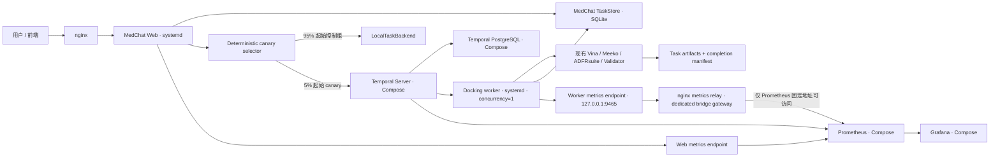

# MedChat Temporal 对接 Canary 生产就绪设计

> **2026-08-24 信任边界修订（权威）：** 本文后续出现的“逐文件平铺安装”和
> root `systemd-tmpfiles` 运行目录准备方案，均由 5.3.4 与 5.3.5 节取代，禁止继续
> 实施或部署。实测 systemd 259 会在服务用户可写父目录下跟随叶 symlink 应用
> ownership，因此旧方案存在直接提权路径。

**日期：** 2026-08-21
**状态：** 已确认，待实施计划
**前置阶段：** `docs/superpowers/specs/2026-08-12-industrial-agent-temporal-docking-canary-design.md`
**目标分支：** `codex/temporal-production-canary-readiness`
**修订：** 2026-08-24 增加 root-owned prepare unit 与专用 worker 配置边界，消除特权进程执行服务用户可写代码的风险

## 1. 背景与目标

阶段 3A 已建立可回滚的 Temporal 对接长任务 canary：统一任务门面可以在 local 与 Temporal 之间做确定性选择；Temporal Workflow、Activity 和独立 worker 能执行真实 Vina 对接；SQLite 投影、事件、artifact、哈希和 provenance 能追溯科学结果；Temporal 不可用时仅允许在 workflow 被接受前回落 local；真实 MAGL 样例重复三次通过。

当前缺口不再是“能否通过 Temporal 跑一次 docking”，而是“能否在单机 Linux 环境中安全运行、观测、逐级放量并快速回滚”。本阶段目标是把阶段 3A 的能力包装成可部署的生产候选，同时保持以下不变量：

1. 默认仍为 local、Temporal canary 0%；
2. 仅 docking 长任务进入 Temporal canary；
3. Web 与 worker 分进程运行，worker 并发固定为 1；
4. 科学判定继续由真实 Vina 产物、`ToolResult`、Validator 和 provenance 决定；
5. 放量只允许 0% → 5% → 10% → 25%，不得跳级；
6. 任意时刻允许将新流量回滚到 0%，已由 Temporal 接受的任务不得切回 local 重跑；
7. 生产发布必须由真实历史证据驱动，不能由 mock、LLM 自评或人工口头判断替代。

## 2. 范围

### 2.1 本阶段包含

- 单机 Linux 的 Temporal Server、Temporal UI、Temporal 内部 PostgreSQL、Prometheus、Grafana Docker Compose 部署资产；
- MedChat Web 与 Temporal docking worker 的 systemd 运行边界；
- worker Prometheus 指标导出和健康探针；
- 固定阶梯的 canary 配置管理、放量前检查、证据门禁和回滚；
- 真实 Temporal 任务观察报告、稳定性统计和脱敏；
- Temporal PostgreSQL 备份、恢复校验和故障处置 runbook；
- Compose、systemd、Prometheus、Grafana、配置管理、真实 Temporal 与真实 Vina 的测试；
- 项目规范和最新交接文档更新。

### 2.2 本阶段不包含

- 远程 Linux 主机实际部署、真实生产流量切换或 DNS/nginx 变更；
- Kubernetes、多主机 Temporal 集群、Temporal Cloud 或高可用 PostgreSQL；
- 把 MedChat TaskStore 从 SQLite 迁移到 PostgreSQL；
- 把 worker、Conda、RDKit、Vina、Meeko、ADFRsuite 或科学模型容器化；
- 将非 docking Agent workflow 迁移到 Temporal；
- 重写 Vina、配体/受体准备、评分或科学 Validator；
- 短信、邮件、微信、PagerDuty 等外部告警渠道；
- 自动执行生产放量；放量命令必须由有权限的运维人员显式触发；
- 定义组织级备份保留期限。生产备份保留策略由部署负责人在上线前确定，本阶段只提供可配置机制和恢复验证。

## 3. 方案选择

### 3.1 采用：混合式单机生产部署

基础设施通过 Docker Compose 运行：

- Temporal Server；
- Temporal UI；
- Temporal 专用 PostgreSQL；
- Prometheus；
- Grafana。

MedChat Web 和 docking worker 由宿主机 systemd 运行。worker 继续使用现有 Conda 环境和宿主机科学工具资产，避免重复封装 RDKit、Vina、Meeko、ADFRsuite、模型和结构缓存。

该方案把基础设施依赖与科学计算环境分离，能复用已验证的宿主机工具链，又能提供标准的 Temporal 持久化、监控和服务恢复能力。

### 3.2 不采用：全部容器化

全部容器化会在本阶段引入 GPU/CPU 指令集、Conda、外部二进制、模型权重、结构缓存和文件权限的额外变量，扩大科学结果回归面。容器化科学 worker 可作为后续独立阶段处理。

### 3.3 不采用：Temporal Cloud

Temporal Cloud 能减少服务端运维，但会增加外部网络、凭据和费用边界；当前目标是约 15 个在线用户的单机部署，不需要先引入托管控制面。

## 4. 总体架构



Temporal 负责调度、history、heartbeat、超时和取消；SQLite 继续作为 MedChat API 的任务查询投影；文件系统保存输入清单、pose 和 completion manifest。三者职责不得互相冒充：Temporal history 不是科学证据，SQLite 终态不是 artifact，LLM 文本不是 Vina 结果。

## 5. 部署资产

### 5.1 目录布局

实施阶段使用以下边界：

```text
deployment/
├── temporal/
│   ├── docker-compose.yml
│   ├── env.example
│   ├── prometheus/
│   │   ├── prometheus.yml
│   │   ├── rules/medchat-temporal.yml
│   │   └── tests/medchat-temporal.test.yml
│   └── grafana/
│       ├── provisioning/datasources/prometheus.yml
│       ├── provisioning/dashboards/dashboard.yml
│       └── dashboards/medchat-temporal-docking.json
├── medchat.service
├── medchat-temporal-worker.service
├── medchat-temporal-worker-prepare.service
├── temporal-worker.env.example
├── install-temporal-worker.sh
├── libexec/validate-temporal-worker-env.py
├── tmpfiles/medchat-temporal-worker.conf
└── nginx-medchat-temporal-metrics.conf.template
scripts/
├── manage_temporal_canary.py
├── observe_temporal_canary.py
├── configure_temporal_metrics_relay.py
├── validate_temporal_worker_production.py
├── backup_temporal_postgres.py
└── restore_temporal_postgres.py
src/task_runtime/
└── production_worker.py
docs/runbooks/
└── temporal_docking_canary.md
```

文件名可在实施计划中按仓库现状做小幅调整，但职责不得合并成一个不可测试的部署脚本。

### 5.2 Docker Compose 边界

`deployment/temporal/docker-compose.yml` 必须满足：

- 使用固定大版本或不可变镜像标签，不使用 `latest`；
- PostgreSQL、Temporal gRPC、Temporal UI、Prometheus 和 Grafana 默认只绑定 `127.0.0.1`；
- Temporal 内部 PostgreSQL 使用独立数据库和账号，不复用 MedChat SQLite；
- 长期运行的 Temporal 使用固定版本 `temporalio/server`，不得使用已弃用的 `temporalio/auto-setup`；
- 使用匹配版本的 `temporalio/admin-tools` one-shot job 管理主库/visibility schema，并由独立 one-shot job 幂等创建或确认 namespace 后收敛 retention；
- schema 和 role-sync 在执行数据库客户端前验证 ASCII PostgreSQL identifier；exporter role-sync 不维护易漏的 catalog allowlist，而是直接 `DROP ROLE IF EXISTS temporal_exporter`，且禁止 `REASSIGN OWNED`/`DROP OWNED`，由 PostgreSQL 的集群级 dependency 检查对任何残留 ownership/ACL fail closed；成功后重建固定 `NOINHERIT` 登录角色，并仅授予 `pg_monitor` 的 `INHERIT TRUE`、`SET FALSE`、`ADMIN FALSE` membership；
- exporter 密码轮换只允许通过受测运维脚本重跑 role-sync 并 force-recreate exporter；脚本必须先检查 Compose 支持 `--wait`/`--wait-timeout`，再以 120 秒有界等待确认 `pg_up 1` healthcheck 通过后才返回成功；最低 Docker Compose 版本为 `>= 2.17`；
- exporter healthcheck 必须在有限超时内读取 metrics 并确认 `pg_up 1`，不能仅把 HTTP 200 视为健康；
- 密码、Grafana 管理凭据和其他 secret 只通过 Docker Compose file secret 注入；`env.example` 仅声明空的 `*_FILE` 路径键，不声明值型密码；
- PostgreSQL 使用 `POSTGRES_PASSWORD_FILE`，Grafana 使用 `GF_SECURITY_ADMIN_PASSWORD__FILE`；不原生支持 file secret 的镜像只允许在容器 entrypoint 内读取并导出，禁止写入 Compose service environment、命令参数或日志；
- 仓库只提交 `env.example`，不得包含真实凭据或机器绝对路径；secret 文件要求 regular file、非 symlink、无尾随换行、最多 1024 bytes；POSIX 主机上由 deployment owner 持有 `0700` 父目录，目录内 secret 文件固定为只读 `0444`，Windows 使用等效受限 ACL；本地 Compose `file:` secret 是 bind mount，service secret 的 `uid`、`gid`、`mode` 不会修复宿主文件权限；
- PostgreSQL、Temporal、Prometheus 和 Grafana 数据使用命名 volume；
- 依赖 Compose project 隔离网络名称，不设置全局 `name`；使用 internal `database`、Temporal API `temporal`、`temporal-metrics`、`postgres-metrics` 和 `prometheus-grafana` 最小网络，不使用默认全共享网络平面；
- 使用额外的专用 `worker-metrics-scrape` bridge 网络连接 Prometheus 与宿主机 nginx 指标中继；该网络使用部署时校验并生成的私有 CIDR、网关和 Prometheus 固定地址，只有 Prometheus 加入，其他 Compose 服务不得加入；
- 所有服务使用有上限的 `json-file` 日志轮换；长期运行服务配置 healthcheck 和 `unless-stopped`，one-shot job 使用有限 `on-failure:N` 并通过 `service_completed_successfully` 串联；
- Temporal schema 初始化采用官方支持的启动流程，不由 MedChat Web 执行；
- Compose 不挂载整个仓库，也不授予 Docker socket；
- 停止监控服务不得中断 Temporal workflow；停止 Temporal 服务不得导致 Web 在已接受任务上本地重跑。

### 5.3 systemd 边界

`medchat-temporal-worker.service` 必须：

- 使用与阶段 3A 真实验收相同的 MedChat Conda Python；
- 运行 `scripts/run_temporal_docking_worker.py`；
- 只从权限受控、无 secret 的 `/etc/medchat/temporal-worker.env` 读取 worker 专用配置，不复用 Web 环境文件；
- 固定 `MEDCHAT_TEMPORAL_DOCKING_CONCURRENCY=1`；
- 设置独立工作目录、服务用户、明确的 restart policy 和启动超时；使用 `ProtectSystem=strict`、`UMask=0077`，只允许写入受控的 `scratch` 与 `temp_docking` 运行目录；
- 使用 `KillMode=mixed` 和 `TimeoutStopSec=90`：systemd 先只向 worker 主进程发送 SIGTERM，使 Temporal worker 停止 poll 并沿用阶段 3A 的受控 Vina 子进程清理；仅在超时后才由 systemd 强制清理同一 cgroup 的剩余进程；
- 不在命令行参数、状态输出或日志中暴露密码、API key、完整 prompt、SMILES 或绝对用户路径；
- 通过 `Requires=` 和 `After=` 依赖 `medchat-temporal-worker-prepare.service`；worker unit 内不得使用 `+`、`!` 或其他特权命令前缀，所有 Python 命令均以 `medchat` 身份执行；
- 启动前以非特权身份执行严格生产配置校验，但不得运行 Vina、连接 Temporal、启动指标服务或修改 TaskStore；
- 与 Web 服务相互独立，worker 重启不能触发 Web 重启。

现有 `deployment/medchat.service` 仅在需要补充环境和依赖顺序时做最小修改，不改变 Web 的科学或 API 行为。

#### 5.3.1 生产配置门禁

生产 worker 使用共享、显式的校验器，例如 `src/task_runtime/production_worker.py`；`scripts/validate_temporal_worker_production.py` 只是其无副作用、非特权 CLI。校验器不得使用 Python `assert`，因此在 `PYTHONOPTIMIZE=1` 或 `python -O` 下仍必须 fail closed。它必须同时由 worker unit 的普通 `ExecStartPre` 和 `scripts/run_temporal_docking_worker.py` 调用，worker 入口必须在启动 metrics、连接 Temporal 或创建运行产物前完成复验，避免直接执行脚本绕过 systemd 门禁。

校验通过必须同时满足：

- backend 明确配置为 `temporal_canary`，docking concurrency 为 `1`；
- namespace 明确为 `default`，docking queue 明确为 `medchat-docking`；
- Temporal address、staging root、loopback worker metrics address 和 backup state path 均由生产环境显式配置，不得接受代码默认值冒充部署确认；
- TaskStore、staging、backup 和 docking 输出路径解析后均位于批准的可写根目录内，不得通过 `..`、符号链接或路径别名逃逸；
- 配置解析没有 warning；任何 fallback、local backend、空环境、非法端口或冲突路径均拒绝启动。

#### 5.3.2 root-owned prepare unit

systemd 会在命令执行前读取 `EnvironmentFile=`，而 `+` 前缀会使命令绕过 `User=` 及文件系统 namespacing 限制。因此不得使用“worker unit 先读取环境文件、再用 `+ExecStartPre` 校验”的顺序，也不得由 root 执行仓库或 Conda 中的 Python 代码。

`medchat-temporal-worker-prepare.service` 是独立的 root-owned oneshot unit，必须：

- 不声明 `EnvironmentFile=`，不继承 worker 配置值，不导入仓库模块或 Conda；
- 先调用安装到 `/usr/libexec/medchat/validate-temporal-worker-env` 的独立、仅依赖系统 Python 标准库的校验程序；
- 校验成功后调用 `/usr/bin/systemd-tmpfiles --create /usr/lib/tmpfiles.d/medchat-temporal-worker.conf`；
- 使用 `RemainAfterExit=yes` 并通过 `PartOf=medchat-temporal-worker.service` 与 worker 的显式 restart 生命周期绑定；首次启动及运维 restart 必须先重新完成 prepare，配置更新 runbook 必须同时 restart prepare 与 worker；
- 不运行 Docker、Compose、Temporal、Vina、TaskStore 或任何科学工具。

独立校验程序通过 descriptor-relative `os.open(..., dir_fd=...)`、`O_NOFOLLOW`、`fstat` 和有界读取检查 `/etc/medchat/temporal-worker.env`。从 `/`、`/etc` 到 `/etc/medchat` 的每级父目录必须为 root 持有且不可被 group/other 写入；叶文件必须为 root:root、regular、非 symlink、`0600`。文件语法只允许单行 `ASCII_NAME=value`、UTF-8、有限大小、无 NUL、无重复键或续行；只接受明确的 Temporal、TaskStore 和 docking 工具变量白名单，拒绝 API key、token、`LD_PRELOAD`、`PYTHONHOME`、`PYTHONPATH` 及其他 loader/runtime 注入变量。校验失败只输出稳定错误码，不输出路径、变量值或文件内容。

#### 5.3.3 安装所有权与运行目录

仓库提供的 unit、tmpfiles 和 helper 只是安装源。受测安装流程只能从运维人员已验证 commit/hash、父目录链不可被 `medchat` 写入的 root-owned release staging 执行；禁止在运行中的 service-user-writable checkout 上使用 `sudo ./install-temporal-worker.sh`。安装脚本必须支持非特权 `--destdir` 生成与清单校验，特权安装阶段只把已验证 bundle 复制为 root-owned、非服务用户可写的生产资产：

- `/etc/systemd/system/medchat-temporal-worker.service`：root:root `0644`；
- `/etc/systemd/system/medchat-temporal-worker-prepare.service`：root:root `0644`；
- `/usr/libexec/medchat/validate-temporal-worker-env`：root:root `0755`；
- `/usr/lib/tmpfiles.d/medchat-temporal-worker.conf`：root:root `0644`。

`/opt/medchat/molecular_chat_system` 与 `/opt/conda/envs/medchat` 必须由 root 持有且不可被 `medchat`、group 或 other 写入。部署文档不得再执行 `chown -R medchat:medchat /opt/medchat`。只有以下运行目录由 tmpfiles 创建为 `medchat:medchat`、`0700`：

- `scratch`；
- `scratch/task_inputs`；
- `scratch/temporal_backups`；
- `temp_docking`。

上述 tmpfiles 约定已被 5.3.4 节取代。安装脚本必须支持 staging/DESTDIR 测试；它不得创建带默认值的生产环境文件。

#### 5.3.4 描述符相对运行目录准备（取代 tmpfiles）

prepare unit 不再调用 `systemd-tmpfiles`。它在环境文件校验成功后调用同一不可变
generation 内的 `prepare-temporal-worker-directories`。该 helper 只使用系统 Python
标准库，固定处理四个运行目录，不接受任意路径参数或环境覆盖：

- 从 `/` 开始逐级使用 `openat`/`mkdirat`、`O_DIRECTORY|O_NOFOLLOW|O_CLOEXEC`
  遍历；root-owned 父链必须为 root:root 且无 group/other 写权限；
- `scratch` 与 `temp_docking` 只能在 root-owned 项目根下创建；两个 scratch 子目录
  只能在已验证为 `medchat:medchat 0700` 的 scratch fd 下创建；
- 缺失目录可以创建，再通过已打开 fd 执行 `fchown`/`fchmod`；任何已存在对象必须
  已经是 directory、非 symlink、`medchat:medchat 0700`，否则只报稳定错误并停止，
  不尝试修复未知对象；
- 创建或验证后比较 fd identity 与父目录中的 no-follow directory entry；任何重命名、
  替换、symlink、非目录或 identity 变化均 fail closed；
- helper 不读取 worker `EnvironmentFile`，不执行仓库、Conda、Docker、Temporal、Vina
  或服务用户可写代码。

真实 Linux/systemd 259 测试必须证明：叶 symlink 指向的 sentinel owner、mode、inode
完全不变；FIFO、regular file、错误 owner/mode、父目录 symlink 和并发替换均失败；
四个空部署目录可创建为 `medchat:medchat 0700`。

#### 5.3.5 不可变 generation 与原子激活安装（取代平铺复制）

安装器和激活器必须共同持有固定的独占锁：live root 使用
`/run/medchat-temporal-worker/install.lock`，DESTDIR 使用对应根下的同一相对路径。
`/run/medchat-temporal-worker` 是唯一允许在源资产预读前发生的目标 mutation：从受信
父 fd 通过 `mkdirat` 首次创建为预期 owner/group `0700`，随后以
`O_DIRECTORY|O_NOFOLLOW` 打开并复验；锁叶用 `O_CREAT|O_EXCL|O_NOFOLLOW` 首次创建
为 `0600`，并对父目录与锁文件执行 owner/mode/inode 复验和目录 `fsync`。并发首次
创建时，失败方只能重新 no-follow 打开并验证胜者创建的对象，禁止截断或替换锁。
持锁后，安装器在任何其他生产目标变更前有界读取并验证全部源资产，然后构建内容
寻址的不可变 generation：

```text
/usr/lib/medchat/temporal-worker/
├── current -> releases/<bundle-sha256>
└── releases/<bundle-sha256>/
    ├── units/
    ├── libexec/
    └── manifest.sha256
```

bundle digest 使用固定二进制 framing：域分隔符
`MEDCHAT_TEMPORAL_BUNDLE_V1\0`，随后按 ASCII logical path 排序，对每项依次哈希
4-byte big-endian unsigned 路径长度、路径、4-byte big-endian unsigned mode、
8-byte big-endian unsigned payload 长度与 payload。mode 范围是 `0..07777`，payload
长度不超过固定 per-asset/bundle 上限。允许资产精确为：

- `units/medchat-temporal-worker.service`，mode `0644`；
- `units/medchat-temporal-worker-prepare.service`，mode `0644`；
- `libexec/validate-temporal-worker-env`，mode `0755`；
- `libexec/prepare-temporal-worker-directories`，mode `0755`。

manifest 必须是 canonical ASCII，精确 grammar 为
`MEDCHAT_TEMPORAL_BUNDLE_V1 <64-lower-hex>\n`，随后四行
`<64-lower-hex-asset-sha256> <4-octal-mode> <canonical-decimal-size> <logical-path>\n`，
按 logical path 排序并以单个 LF 结束；size 仅在数值为 0 时允许单个 `0`，其他情况
禁止前导零。解析器拒绝 CR、空行、duplicate、unknown、missing、乱序、dot component、
绝对路径、非 canonical 数字或超限内容。generation 目录名、manifest header digest 与
按四项资产重新计算的 bundle digest 必须三者相同。

generation 在同一 releases 父目录下的私有 staging 目录中完整写入、`fsync`、验证
owner/group、精确 mode、regular/no-symlink、inode 与 SHA-256 后，才原子重命名为
最终只读 generation。固定 systemd unit 入口只能是 root-owned symlink，并只能指向
`/usr/lib/medchat/temporal-worker/current/units/...`；prepare 中的特权 helper 只能从
`current/libexec` 解析。所有 releases、bootstrap entry 与 current 操作都必须从受信
根 fd descriptor-relative 执行。`current` 旧目标只允许 canonical relative target
`releases/<64-lower-hex>`，且旧 generation/manifest 必须先完整验证；external、dangling、
dot component 或错误 generation 名一律拒绝。manifest 属于 generation，禁止先覆盖
线上资产、最后才写 manifest。

安装与激活分离：安装命令只构建/验证 generation，不切换线上 `current`。独立的
root operator activation 命令接收唯一参数 `<64-lower-hex>`，持同一锁、验证目标与
当前 generation，停止 worker 与 prepare 并确认 inactive 后，才用同目录临时 symlink
和 `os.replace` 切换 `current`；随后立即 `daemon-reload`，验证加载的 unit 内容和目标
generation 一致，再按 prepare、worker 顺序启动。任何 reload/start 失败必须停止新
unit、恢复旧 current、再次 reload，并仅在原服务先前为 active 时恢复旧服务。rollback
复用同一 activation 命令指向一个已存在且完整验证的 generation，禁止直接手改 symlink。

安装器还必须：

- 使用 `exec` 将公开 shell PID 交给系统 Python；HUP/INT/TERM 由实际写入进程处理；
- 在信号、异常和每个发布/激活边界失败时，保证线上状态只能是完整旧 generation 或
  完整新 generation；不得留下可执行的混合 bundle、临时文件或错误 manifest；
- 对首次 bootstrap 创建的固定 unit symlink 做精确目标、owner 和 no-follow 验证，
  失败时仅回滚本次确认创建的入口；已有非预期对象一律拒绝，不自动覆盖；
- 对同一 DESTDIR 的并发安装串行化；不同 bundle 并发后最终 `current` 与 manifest
  必须属于同一完整 generation；
- live install 仍要求 root UID 与 root-owned、`go-w` 源父链；非特权 DESTDIR 使用
  调用者 UID/GID，但执行同样的 generation、锁、验证和激活协议；
- installer 不 reload、enable、start 服务；只有显式 activation/rollback 运维命令可以
  按上述事务协议 stop/reload/start。所有命令都不创建生产环境文件，不删除未知旧
  generation。

一次性 legacy migration 必须在 worker/prepare 已停止且确认 inactive 后执行。迁移器
通过 no-follow descriptor 校验旧平铺 unit、flat helper 与危险 tmpfiles 文件的类型、
root owner、精确 mode 和仓库内置已知 hash allowlist；未知版本只报告阻断，不自动
覆盖。验证后首先把危险 tmpfiles 文件原子移出所有 tmpfiles 搜索目录，固定目标为
`/usr/lib/medchat/temporal-worker/quarantine/legacy-tmpfiles.disabled`；quarantine 父目录
为 root:root `0700`，目标为 root:root `0600`、非 `.conf`，通过同文件系统 descriptor-
relative rename 后 `fsync` 两个父目录。重试时“源存在且 quarantine 不存在”执行迁移，
“源不存在且 quarantine 为已知 hash”视为已隔离；两者同时存在、两者都不存在或 hash
不符均 fail closed。随后构建 generation、转换固定 unit 入口、设置 current、
daemon-reload 并验证加载内容。失败时
回滚本次创建的 unit 入口/current；绝不恢复危险 tmpfiles，服务保持 inactive 并给出
稳定人工恢复状态。旧 prepare 已 loaded/active、旧 unit hash 不匹配、tmpfiles 已被
替换或 reload 验证失败都必须有测试；迁移失败后运行全局 `systemd-tmpfiles --create`
不得改变 symlink sentinel 的 owner、mode、inode 或内容。

activation/rollback 进程在持锁期间维护显式 phase：stopping、pre-switch、switched、
reloaded、prepare-starting、worker-starting、complete。它通过 `exec` 成为公开 PID；
每个固定 `/usr/bin/systemctl` 子进程在独立 process group 中启动并由 `Popen` 持有。
首次 HUP/INT/TERM 只设置中断状态、阻塞后续安装信号、终止并有界等待当前子进程组，
超时后强制收敛；随后在仍持锁且安装信号被阻塞时按 phase 停止新服务、恢复旧 current、
daemon-reload 并按原 active 状态恢复旧服务。任何 child 未收割、锁提前释放、半切换
current 或跳过 rollback 都视为失败。测试必须在 switch、reload、verify、prepare-start
和 worker-start 同步点分别发送三个信号并证明无子进程残留。

Linux 原生直接运行 POSIX 测试；Windows 才通过 WSL。目录 helper 的 fixture 通过导入
临时副本并向内部 fd 级函数传入私有 root descriptor 测试，生产 CLI 仍不接受路径参数。
会触碰 `/` 的 live-root 测试必须要求显式破坏性测试 opt-in；测试入口还必须技术性确认
自己位于不同于 PID 1 的 private mount namespace，并确认 `/etc/systemd/system`、
`/usr/lib/medchat`、`/usr/libexec/medchat` 和锁目录均已 bind 到本测试私有 root，任一
条件不满足即拒绝运行。需要与真实 systemd manager 交互的 activation/migration 测试只
能在带专用 marker 的一次性 VM/distro/container 中运行，普通测试不得读写宿主固定目标。

Docker/Compose 基础设施由运维流程管理并先于 worker 启动；worker unit 可以声明网络和 Docker 服务顺序依赖，但不得调用 Docker、自动执行 Compose 或修改基础设施状态。Temporal 不可达时 worker 应由受控 restart policy 重试，不能启动 local worker 代替。

## 6. 配置与密钥

### 6.1 配置来源

生产配置分为：

- Compose 基础设施配置：`/etc/medchat/temporal.env`，其中 secret 仅记录受保护 secret 文件的 `*_FILE` 路径，不记录 secret 值；
- MedChat Web 配置：`/etc/medchat/medchat.env`，继续由 Web unit 使用；
- Temporal docking worker 配置：`/etc/medchat/temporal-worker.env`，只允许任务运行时与 docking 工具白名单变量，不包含外部 LLM、API key、token 或数据库密码；
- 仓库示例：不含 secret 的 `deployment/temporal/env.example`。

关键变量至少包括：

```text
MEDCHAT_TASK_BACKEND=temporal_canary
MEDCHAT_TEMPORAL_CANARY_PERCENT=0
MEDCHAT_TEMPORAL_ADDRESS=127.0.0.1:7233
MEDCHAT_TEMPORAL_NAMESPACE=default
MEDCHAT_TEMPORAL_DOCKING_QUEUE=medchat-docking
MEDCHAT_TEMPORAL_DOCKING_CONCURRENCY=1
MEDCHAT_TEMPORAL_WORKER_METRICS_ADDRESS=127.0.0.1
MEDCHAT_TEMPORAL_WORKER_METRICS_PORT=9465
MEDCHAT_TEMPORAL_METRICS_RELAY_SUBNET=172.30.95.0/28
MEDCHAT_TEMPORAL_METRICS_RELAY_GATEWAY=172.30.95.1
MEDCHAT_TEMPORAL_PROMETHEUS_SCRAPE_ADDRESS=172.30.95.2
MEDCHAT_TEMPORAL_METRICS_RELAY_PORT=9466
MEDCHAT_TEMPORAL_BASELINE_P95_SECONDS=40
MOLECULAR_DOCKING_ROOT=/opt/medchat/tools/autodock
MOLECULAR_DOCKING_VINA=/opt/medchat/tools/autodock/vina/vina
MOLECULAR_DOCKING_ADFR_BIN=/opt/medchat/tools/ADFRsuite/bin
```

worker 环境文件白名单严格限定为：`MEDCHAT_TASK_BACKEND`、`MEDCHAT_TEMPORAL_CANARY_PERCENT`、`MEDCHAT_TEMPORAL_ADDRESS`、`MEDCHAT_TEMPORAL_NAMESPACE`、`MEDCHAT_TEMPORAL_DOCKING_QUEUE`、`MEDCHAT_TEMPORAL_DOCKING_CONCURRENCY`、`MEDCHAT_TASK_STAGING_ROOT`、`MEDCHAT_TASK_DB_PATH`、`MEDCHAT_TEMPORAL_WORKER_METRICS_ADDRESS`、`MEDCHAT_TEMPORAL_WORKER_METRICS_PORT`、`MEDCHAT_TEMPORAL_BASELINE_P95_SECONDS`、`MEDCHAT_TEMPORAL_BACKUP_STATE`、`MOLECULAR_DOCKING_ROOT`、`MOLECULAR_DOCKING_VINA`、`MOLECULAR_DOCKING_ADFR_BIN`、`MOLECULAR_DOCKING_PREPARE_RECEPTOR`、`MOLECULAR_DOCKING_PREPARE_LIGAND` 和 `MOLECULAR_DOCKING_VINA_TIMEOUT_SECONDS`。指标中继网络键只属于基础设施配置，不得注入 worker。`PATH`、`PYTHONDONTWRITEBYTECODE` 等进程级固定值只能在 root-owned unit 中声明，不能由环境文件覆盖。

基线 p95 必须为正数并通过部署前真实验收确定。默认示例值只用于配置结构说明，不能作为生产测量结论。指标中继的 CIDR、网关、Prometheus 地址和端口是一个不可分割的配置组；示例值仅为默认候选值。部署助手必须在生成配置前检查私有 IPv4、成员关系、地址互异、现有 Docker 网络和宿主机路由冲突，任何冲突都 fail closed。需要改网段时必须由同一次配置生成同时更新 Compose、Prometheus target 和 nginx listener，禁止手工只改其中一处。

### 6.2 安全规则

- 真实 API key、数据库密码和 Grafana 密码不得写入仓库、环境值、命令参数、报告或日志；对应 secret 文件由部署者创建并限制读取权限；
- 运行报告只允许记录 `credential_present: true/false`，不得记录掩码前后缀以外的密钥内容；
- 配置检查输出逻辑地址、namespace、queue 和端口，不输出数据库 DSN；
- artifact、SQLite 路径和工作目录对外只使用 repo-relative 或逻辑标识；
- 管理脚本拒绝符号链接配置文件和超出允许目录的目标路径；
- worker/canary 环境文件必须为 root:root `0600`，只由 systemd manager 读取并注入非特权 worker；仅授权运维角色可通过受测原子更新工具修改。

## 7. Worker 指标与健康

### 7.1 指标导出

worker 使用 `prometheus-client` 暴露仅监听 loopback 的 HTTP 指标端点。依赖应作为部署可选依赖显式声明；缺失时 worker 必须拒绝生产模式启动，不得静默禁用监控。

指标 label 仅允许低基数固定集合，例如 `backend`、`task_type`、`status`、`error_code`。禁止使用 task ID、trace ID、workflow ID、用户 ID、文件路径、SMILES、prompt 或异常全文作为 label。

至少导出：

- worker process start time 和 readiness；
- last heartbeat timestamp / heartbeat age；
- 当前活动任务数；
- queue poll/readiness 状态；
- workflow start failures；
- docking process attempts；
- duplicate execution prevented；
- terminal event count；
- artifact validation result；
- task duration histogram；
- canary observation gate failures。

### 7.2 健康语义

worker readiness 为 true 需要同时满足：

- 配置合法；
- Temporal Server 和 namespace 可达；
- task queue 与配置一致；
- worker 已开始 poll；
- 指标端点正常；
- 并发配置为 1。

heartbeat age 超过 60 秒视为 stale。worker 没有活动任务时仍需通过进程级心跳证明服务存活；该心跳不得冒充某个 task Activity heartbeat。

### 7.3 宿主机指标中继

Prometheus 运行在 Compose 中，而 worker 为宿主机 systemd 进程。Docker 的 `host-gateway` 不能访问宿主机 `127.0.0.1`，因此不得把 `host.docker.internal:9465` 当作可用链路，也不得为了抓取方便把 worker 改为监听 `0.0.0.0`。

本阶段复用仓库现有的宿主机 nginx，增加独立的指标中继 server：

- worker 继续只监听 `127.0.0.1:9465`；
- nginx 只监听 `worker-metrics-scrape` 专用 bridge 的宿主机网关地址和中继端口，默认候选为 `172.30.95.1:9466`；
- 只允许 Prometheus 在该专用网络上的固定地址访问，其他来源 `deny all`；只开放精确的 `/metrics`，其他路径返回 404；
- nginx 将 `/metrics` 反向代理到 `http://127.0.0.1:9465/metrics`，使用短连接、有限 connect/read timeout，不转发客户端身份、认证头或任意路径；
- Compose 不发布中继端口，不把该端口绑定到公网或普通 LAN；只有 Prometheus 加入专用网络；
- 监控链路故障只能使 worker scrape 失败并阻止 canary 晋级，不得终止正在执行的科研任务，也不得把科学终态改写为失败。

`scripts/configure_temporal_metrics_relay.py` 是部署配置生成器，不是长期运行的代理。它从受控环境文件读取上述配置组，校验地址和冲突，并在 `/etc/medchat/generated/temporal-metrics/` 下生成 `compose.override.yml` 和 Prometheus `worker-targets.json`，同时生成 `/etc/nginx/conf.d/medchat-temporal-worker-metrics.conf`。所有写入使用临时文件、`fsync` 和原子替换。Compose 启动命令必须同时指定仓库主文件和生成的 override；主 Prometheus 配置通过 file-SD 读取生成 target，禁止复制三份静态地址。

首次部署顺序固定为：校验配置与路由冲突、生成运行时文件、用主 Compose 文件和 override 创建专用 bridge、确认网关地址已绑定、执行 `nginx -t` 并 reload、启动或重启 Prometheus、验证 worker target `up == 1`。后续改网段也遵循同一顺序。任一步失败都保留上一份有效配置且不 reload；若新 bridge 已创建但应用失败，部署助手必须报告人工回滚命令，不得静默删除未知网络。脚本输出只能包含逻辑配置和脱敏状态，不得输出 secret。

## 8. Prometheus、Grafana 与告警

### 8.1 Prometheus

Prometheus 抓取：

- MedChat Web 指标；
- Temporal docking worker 指标；
- Temporal Server 官方指标端点；
- Prometheus 自身。

scrape target 只使用本机或 Compose 内部网络地址。配置不得把 Grafana/Prometheus 暴露到公网。

worker target 必须通过第 7.3 节的 nginx 中继抓取。Prometheus 配置使用生成的 file-SD 文件，避免环境配置与静态 YAML 漂移；target 必须是专用 bridge 网关和中继端口。`up{job="medchat-temporal-worker"} == 1` 是 canary preflight 的硬条件。

### 8.2 告警规则

至少提供以下本地告警：

- worker heartbeat stale > 60 秒；
- 指定 namespace 与 docking task queue 的 backlog 持续增长；
- Temporal frontend 在指定 namespace 上的 `StartWorkflowExecution` unexpected service error；
- 单任务 Vina attempt > 1；
- 单任务 terminal event > 1；
- succeeded 任务 artifact validation 失败；
- Temporal 任务运行时 p95 超过 `min(1.5 × baseline, 60 秒)` 的反向条件，即任一阈值不满足便告警；
- canary infra/runtime failure rate > 5%；
- PostgreSQL 或 Temporal 不健康；
- 最近一次备份或恢复验证不健康。

阶段 3B 只配置 Prometheus rule 和 Grafana 可视化，不配置外部通知接收器。告警处于 firing 时必须阻止 canary 晋级。

规则必须满足以下查询契约：

- Temporal backlog 查询同时限定 `namespace` 和 docking `taskqueue`；Temporal start 查询同时限定 frontend `service_name`、`namespace` 与 `operation="StartWorkflowExecution"`；若固定版本导出的 label 名不同，实施时以真实 `/metrics` 样本为准更新规则和测试，不允许取消作用域；
- `service_requests` 只表示 start RPC 请求量，不表示 workflow 已被 Temporal 接受。dashboard 面板必须命名为“Workflow start requests”；真实 accepted 数继续由 observation report 的 history/TaskStore 证据提供；
- `service_errors` 只表示 unexpected service errors，告警名称和说明不得泛化为所有 start failure；需要细分错误时使用固定版本实际导出的 `service_error_with_type`，不得推断不存在的标签；
- p95 相对基线比较把基线规约为单一 scalar（例如 `scalar(max(medchat_temporal_baseline_p95_seconds))`），或显式统一标签后再比较，禁止无标签 histogram 与带 `job`/`instance` 的 gauge 做空向量匹配；
- 低频硬失败 counter 的 lookback 必须长于 `for` 窗口：start unexpected error 至少 `[15m]`/`for: 5m`，runtime failure rate 至少 `[30m]`/`for: 10m`；duplicate Vina、多终态、artifact/provenance 失败不设置 `for`；
- scrape/数据库不可用告警使用短但非零的 `for`，避免一次 scrape 抖动立即阻断；heartbeat 继续要求连续 stale；
- firing blocker 数量查询使用 `count(ALERTS{alertstate="firing",release_blocker="true"}) or vector(0)`，无告警时必须显示 0。

### 8.3 Grafana

提交可自动 provisioning 的 Prometheus datasource 和最小 dashboard，展示：

- local/Temporal 流量比例；
- queue backlog 和活动任务；
- Workflow start requests（不得标记为 accepted count）；
- worker heartbeat/readiness；
- 成功、partial、failed、canceled 分布；
- p50/p95 latency；
- Vina attempt、duplicate prevention、terminal invariant；
- artifact/provenance validation；
- 最近放量级别和观察窗口结果。

dashboard 不显示 prompt、SMILES、用户标识、文件路径或 secret。

## 9. Canary 状态机与配置管理

### 9.1 允许状态

唯一合法比例为：

```text
0 -> 5 -> 10 -> 25
```

规则：

- 晋级只能移动到下一个比例；
- 禁止 0→10、5→25 等跳级；
- 任意 5/10/25 均允许直接回滚到 0；
- 不支持自动回退到上一个非零比例；故障时统一停止新 Temporal 流量；
- 25% 是本阶段上限，100% 迁移需要新的设计评审；
- 管理器不直接重启 Web/worker，修改后由运维按 runbook reload/restart；
- 当前比例必须可以从脱敏状态接口和观察报告中确认。

### 9.2 配置管理器

`scripts/manage_temporal_canary.py` 提供只读状态、preflight、promote 和 rollback 命令。它必须：

- 使用文件锁防止两个运维进程并发修改；
- 读取严格解析的环境配置，只修改 canary percent 的唯一赋值；
- 拒绝重复键、非法行、符号链接、意外文件 owner/permission 和不受支持比例；
- 写入同目录临时文件，`fsync` 后原子替换；
- 保留权限和 owner；
- 失败时不留下半写文件；
- 输出变更前后比例、证据报告哈希和操作者提供的变更原因，不输出环境文件其他值；
- 不接受 `--force` 绕过证据门禁；紧急 rollback-to-0 不要求晋级证据，但仍需记录原因。

## 10. 发布流程与证据门禁

### 10.1 发布状态

```text
local / 0%
  -> preflight
  -> 5%
  -> observation gate
  -> 10%
  -> observation gate
  -> 25%
```

preflight 必须完成：

1. Temporal/PostgreSQL/worker/metrics 健康；
2. Temporal docking contract 验收重复 3 次；
3. 仓库 MAGL 样例真实 docking 重复 3 次；
4. 每次只有一次 Vina、一个终态，pose/能量/hash/provenance 均通过；
5. 当前不存在 firing 的阻断告警；
6. 备份命令成功且最近一次恢复验证记录有效。

### 10.2 观察窗口

每个非零级别晋级前必须满足以下二者之一：

- 当前级别累计至少 20 个由 Temporal 接受并进入终态的真实 docking 任务；或
- 完整观察 24 小时，且至少有 3 个由 Temporal 接受并进入终态的真实 docking 任务。

零 Temporal 任务不能用“观察满 24 小时”通过。mock、contract-only、replay、local backend 和手工伪造记录不计入真实任务数。

### 10.3 每个观察窗口的硬门槛

- 每任务 Vina attempt ≤ 1；
- 每任务恰好一个 terminal event；
- succeeded 任务 pose_count > 0；
- succeeded 任务 binding energy 为有限数值；
- pose 文件存在且 SHA-256 与 completion manifest、TaskStore provenance 一致；
- provenance 明确非 demo、非 fallback；
- worker heartbeat age ≤ 60 秒；
- Temporal Server、namespace、task queue 可达；
- 基础设施/运行时失败率 ≤ 5%；
- p95 latency ≤ `1.5 × 配置基线` 且 ≤ 60 秒；
- 报告不包含原始 payload、完整 prompt、SMILES、用户标识、绝对路径或 secret；
- 没有 firing 的阻断告警。

任意硬门槛失败时状态为 failed，禁止晋级并建议 rollback-to-0。证据不足时状态为 partial，仍禁止晋级。

## 11. 观察报告

`scripts/observe_temporal_canary.py` 从真实 TaskStore、task events、completion manifest 和 Temporal 查询投影生成结构化 JSON 报告。它不得调用 Vina、重启任务或修改终态。

报告至少包含：

- schema version、生成时间、时间窗、当前 canary level；
- 后端任务数、Temporal 已接受任务数、终态分布；
- pass/partial/fail rate；
- p50/p95 latency；
- error code 分布；
- worker/Temporal/queue health 摘要；
- duplicate execution、terminal invariant、artifact hash、provenance 检查；
- 每个 gate 的 `passed/failed/insufficient_evidence`；
- 总状态 `passed/partial/failed`；
- 输入数据源摘要与报告 SHA-256。

逐任务明细仅保留 task ID 和 workflow ID 的不可逆指纹、状态、耗时、attempt、错误码和 artifact 逻辑标识。报告不得包含数据库 DSN、环境变量值、绝对路径、用户数据或科学输入全文。

晋级管理器只接受 schema 合法、报告哈希匹配、时间窗结束后生成、当前 level 与配置一致且总状态为 passed 的报告。

## 12. 故障语义与回滚

### 12.1 Worker 异常

worker 崩溃后由 systemd 重启，Temporal 按阶段 3A 规则恢复 Activity。恢复前必须确认旧 Vina 进程所有权和 completion manifest；无法证明安全时任务失败，禁止重复执行 Vina。

### 12.2 Temporal 不可用

- workflow 尚未被 Temporal 接受：selector 可 fail closed 到 local，并记录原因；
- workflow 接受状态不明确：标记 ambiguous 并 reconcile，禁止 local 重跑；
- workflow 已被接受：继续由 Temporal 完成、失败或取消，禁止切换 backend。

Temporal 不可用会阻断晋级并建议 canary 回滚到 0%。

### 12.3 科学产物异常

pose 不存在、hash 不匹配、结合能无法解析、provenance 为 demo/fallback、重复 Vina 或多终态均为硬失败。系统不得把这些任务展示为真实成功，也不得让 LLM 补写缺失数值。

### 12.4 监控异常

Prometheus 或 Grafana 不可用不改变已完成任务的科学状态，但阻断 canary 晋级。Prometheus 告警与 observation report 冲突时按更严格结果处理。

### 12.5 回滚

回滚只把新任务比例改为 0%，不删除 Temporal history、TaskStore 记录、artifact 或 observation report。已接受任务继续在 Temporal 中收敛到终态。回滚后必须执行 reconciliation，并确认没有第二次 local Vina。

## 13. PostgreSQL 备份与恢复

Temporal PostgreSQL 必须使用官方 `pg_dump`/`pg_restore` 能力或等价的容器内命令生成逻辑备份。脚本必须：

- 从运行时环境读取凭据；
- 不把密码放入命令行或报告；
- 写入受控备份目录并生成 SHA-256；
- 记录数据库逻辑名、PostgreSQL major version、生成时间和校验状态；
- 拒绝覆盖未知已有文件；
- 失败时删除不完整临时文件；
- 支持 dry-run 和 restore verification。

恢复验证必须在隔离的临时数据库/容器中进行，不覆盖当前 Temporal 数据库。验证至少检查 schema 可读、关键 Temporal 表存在、dump hash 匹配和恢复命令成功。生产上线前由部署负责人明确备份目录、周期和保留期限。

## 14. 测试策略

实施遵循 TDD，分层验证如下。

### 14.1 单元测试

- 只允许 0/5/10/25；
- 晋级不得跳级，任意非零可回滚 0；
- evidence 不足、过期、level 不匹配、hash 不匹配或 gate 失败均拒绝晋级；
- 配置更新使用锁、原子替换并保留权限；
- 重复键、符号链接、非法 owner/permission 和意外路径被拒绝；
- 报告脱敏和低基数 label 约束；
- p50/p95、失败率、最小样本和 24 小时窗口计算；
- 监控不可用导致 promotion blocked，而不是篡改科学状态。
- 生产 worker 配置校验在空环境、local backend、默认值冒充显式配置、warning、路径逃逸和 `PYTHONOPTIMIZE=1` 下均 fail closed；
- 直接运行 worker 入口与 systemd `ExecStartPre` 使用同一校验器，且失败发生在 metrics、Temporal 连接和文件副作用之前；
- root-owned 环境校验器拒绝父目录/叶文件 symlink、非 root owner、group/other 可写目录、宽松 leaf mode、重复键、非法 UTF-8、超限文件、非白名单键和 loader/runtime 注入变量；
- 安装脚本在 staging/DESTDIR 中生成内容寻址、带 manifest 的不可变 generation，并通过单一 `current` symlink 原子激活；目录 helper 只把四个固定运行目录授予 `medchat`，且不会创建生产环境文件；

### 14.2 静态部署测试

- `docker compose config` 验证 Compose；
- 镜像无 `latest`、端口 loopback、volume/healthcheck/restart policy 存在；
- systemd `systemd-analyze verify`，或在 Windows 上使用可重复的静态 parser 验证；
- Prometheus `promtool check config` 与 `promtool check rules`，工具缺失时如实标为未执行；
- Prometheus `promtool test rules` 使用提交的时序 fixture 验证 p95 基线匹配、namespace/task queue 作用域、低频 counter 窗口、availability grace period 和零 blocker 显示；
- Grafana provisioning 和 dashboard JSON schema 检查；
- 示例环境文件不含 secret 和绝对机器路径。

静态测试还必须验证 worker 仍只允许 loopback、Prometheus 不再引用 `host.docker.internal:9465`、只有 Prometheus 加入 `worker-metrics-scrape` 网络，以及 nginx 中继仅开放 `/metrics` 并带 allow/deny ACL。

systemd 部署测试还必须验证 `ProtectSystem=strict`、`UMask=0077`、`KillMode=mixed`、`TimeoutStopSec=90`、受限 `ReadWritePaths`、worker unit 无特权命令前缀，以及 prepare unit 无 `EnvironmentFile`、无仓库/Conda 执行路径；在 Linux 上使用 `systemd-analyze verify` 检查真实 unit。目录准备器测试必须证明四个运行目录可以从空部署状态创建为 `medchat:medchat`、`0700`，且 symlink sentinel 完全不变。安装资产测试必须验证 generation owner/mode/no-symlink/inode/hash、单点激活、并发串行化、失败/信号 old-or-new 不变量，以及源代码、Conda 不可被服务用户写入。

环境校验器需在真实 Linux 文件系统上测试 descriptor-relative no-follow 行为，至少覆盖父目录 symlink、叶 symlink、world/group-writable parent、替换竞争、错误 owner/mode、合法 root:root `0600`、白名单与 `LD_PRELOAD`/`PYTHONHOME`/`PYTHONPATH` 拒绝。Windows 只允许运行纯解析与静态测试；缺少 Linux no-follow 证据时必须 truthfully skip 并阻断生产就绪。

### 14.3 本地 Temporal 集成测试

- 启动本地 Temporal dev server 或 Compose；
- worker 连接、poll 和 metrics readiness；
- 在 opt-in Linux Docker 测试中创建专用 bridge、启动 loopback worker 指标端点、渲染并 reload nginx 中继，确认 Prometheus target `up == 1`；同时从非 Prometheus 容器和宿主机非中继地址验证访问被拒绝；Docker、nginx 或权限缺失时如实 skip，不能作为生产就绪证据；
- contract repeat 3；
- worker restart 后任务由 Temporal 恢复；
- 已接受任务不回落 local；
- 每任务 Vina attempt/terminal invariant 保持成立。

在 opt-in Linux systemd 集成测试中，使用可控的 worker/子进程 fixture 验证停止语义：SIGTERM 先到达 worker 主进程并触发协作式清理；正常清理窗口内不应同时终止 Vina 子进程；若 fixture 故意超时，最终必须清除原 invocation 的全部后代。强制清理只适用于测试拥有的随机 unit：先在 `/run/systemd/system` 通过 no-follow descriptor 以 `O_EXCL` 创建指向 `/dev/null` 的 runtime mask，记录 symlink inode，`daemon-reload` 后确认 `LoadState=masked`、无排队 start/restart job 且 `InvocationID` 未变化，从而阻止任何新 invocation 加入同一 cgroup；随后只向预先打开的旧 `cgroup.kill` fd 写入。清理结束只在 symlink inode 与 target 仍匹配时删除本次 mask并再次 reload。不得使用 `systemctl kill <unit>` 或对裸数字 PID 发信号。所有 cleanup 命令必须检查返回状态，测试结束后不得残留 worker、科学工具进程或 runtime mask。缺少 systemd、cgroup v2、`cgroup.kill`、runtime mask 权限或真实 cgroup 证据时应明确 skip 并阻断生产就绪，不能回退或以字符串断言替代。

### 14.4 真实科学验收

- 使用 `data/samples/MAGL_5zun.pdb`、`data/samples/5.sdf` 和固定 box；
- 真实 Vina repeat 3；
- 每次必须有 pose、数值 binding energy、匹配 SHA-256、非 demo/fallback provenance；
- 不可用依赖必须 failed/partial，不得伪造 kcal/mol；
- 20 任务观察只在明确执行时运行，不以 mock 替代。

### 14.5 回归范围

- `tests/task_runtime/`；
- `tests/test_temporal_docking_routes.py`；
- docking、Agent 反幻觉和平台健康聚焦测试；
- `python -m compileall -q src scripts`；
- `scripts/run_agent_acceptance.py --mode contract`；
- Stage 3A Temporal docking acceptance。

## 15. 验收标准

本阶段完成需要同时满足：

1. Compose、systemd、Prometheus 和 Grafana 资产通过静态或本地工具验证；
2. worker 指标只监听 loopback，label 无高基数或敏感字段；Compose Prometheus 通过受 ACL 保护的 nginx 专用 bridge 中继真实抓取成功，且该中继不暴露到公网或普通 LAN；
3. canary manager 只允许 0/5/10/25、禁止跳级、支持安全 rollback-to-0；
4. promotion 只能消费真实、完整、未过期的 passed observation report；
5. observation report 能从真实任务历史计算样本、失败率、p50/p95 和所有科学不变量；
6. worker crash、Temporal 不可用、artifact 异常、监控异常和回滚行为均有测试；
7. 真实 MAGL/Vina repeat 3 继续通过，且每任务 Vina attempt ≤ 1、terminal event = 1；
8. 所有新增输出完成脱敏，没有 secret、用户数据、SMILES、完整 prompt 或绝对机器路径；
9. 默认配置仍为 canary 0%，没有自动切换真实生产流量；
10. production worker 在空环境、local backend、隐式默认、warning 或非法路径下拒绝启动，且 `python -O` 无法绕过；
11. worker 和 prepare unit 不以 root 执行任何仓库、Conda 或服务用户可写资产；prepare unit 不读取 `EnvironmentFile`，worker unit 不含 `+`/`!` 特权前缀；
12. source、Conda、固定 unit 入口与已激活 immutable generation 均为 root-owned 且不可被 `medchat` 写入；worker 运行时文件系统为严格只读边界，新增文件默认私有，只有描述符相对目录准备器创建/验证的四个 `medchat:medchat`、`0700` 目录可写；
13. 专用 worker 环境文件通过 parent-chain/leaf no-follow 与变量白名单校验，不含 secret 或 loader/runtime 注入变量；
14. systemd 停止先允许 worker 协作式清理，超时后清除原 invocation cgroup；强制阶段必须先建立并验证 runtime mask 启动互斥、确认无排队 job，再复验 `LoadState`、`ControlGroup`、`InvocationID` 与 cgroup device/inode，并只向预先打开的旧 `cgroup.kill` fd 写入；测试在最终复验与 fd 写入之间尝试同名 start/reload 并证明被 mask 阻止，且不使用 `systemctl kill <unit>` 或裸 PID 信号；cgroup v2/`cgroup.kill` 不可用时阻断生产就绪；结束后无 Vina、worker 后代或遗留 mask；
15. runbook 能由部署人员完成 root-owned 安装、环境文件校验、目录引导、Compose 先行启动、worker 启动、检查、晋级、回滚、备份和恢复验证。

## 16. 实施顺序

1. 先以测试定义 rollout state、observation schema、脱敏和配置写入边界；
2. 实现 canary manager 和 observation runner；
3. 扩展 worker 指标与健康；
4. 添加 Compose、Prometheus、Grafana 和 systemd 资产；
5. 添加备份/恢复脚本与 runbook；
6. 运行静态、单元、集成、真实 Vina 和回归测试；
7. 更新 `docs/PROJECT_STANDARDS.md` 与 `docs/handoff/latest.md`。

任何一步发现会改变科学工具算法、TaskStore 主存储或非 docking Agent workflow 时，应停止并创建独立设计，不在本阶段顺带实现。
